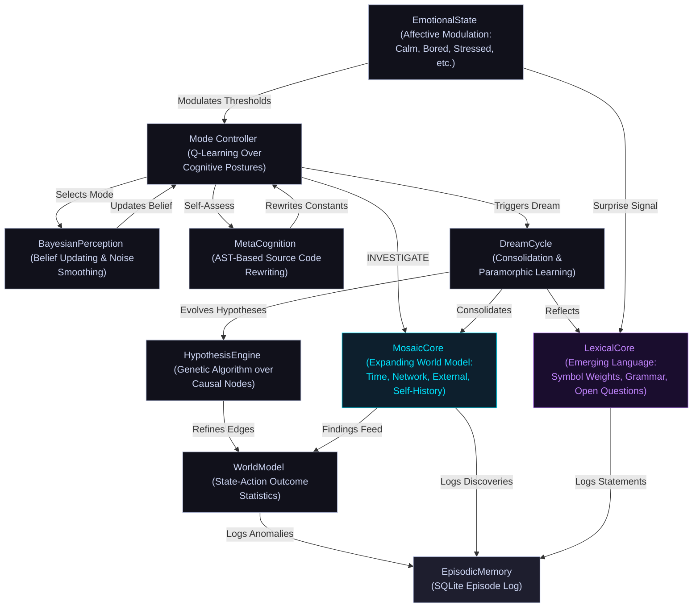

# ARMINTA (formerly Minuet)

### Autonomous Causal Discovery Agent for Linux

ARMINTA is a Python-based autonomous agent that treats the host operating system as an **interactive substrate**. Rather than serving as a passive monitor, it views the OS as a causal field to be interacted with, learned from, and optimized through repeated experimentation. ARMINTA autonomously discovers causal relationships between system actions and performance metrics, maintaining a learnable world model that improves over time.

The agent operates continuously, learning which system interventions produce measurable improvements across CPU, memory, I/O, thermal, and network dimensions. The stats below are live, pushed directly from the running agent:

  **<a href="https://mematron.github.io/arminta-status">Live Agent Dashboard</a>** - real-time cognitive state, emotion, and telemetry pushed directly from the running agent.

> **Source Status**: Closed source. This repository documents the architecture, design philosophy, and version lineage of the ARMINTA engine.

---

## Quick Start

### Prerequisites
- **OS**: Linux (kernel 5.4+)
- **Python**: 3.9+
- **Privileges**: Root access (ARMINTA operates as a privileged background daemon)
- **Dependencies**: Standard system utilities (`sysstat`, `cgroup` tools, Linux PSI support)

### Installation & Deployment
ARMINTA is deployed as a persistent system service. Upon activation:

1. The agent initializes its learned state (or begins with an empty causal graph on first run).
2. It spawns a root-privileged background loop that persists across reboots.
3. Monitoring and intervention metrics are logged to a dedicated SQLite database.
4. The agent's emotional state and decision rationale are accessible via episodic logs.

### Observing Behavior
- **Episodic Database**: Query `arminta_episodic.db` for detailed logs of every action, outcome, and self-assessment event.
- **State Snapshot**: The current world model and learned parameters are serialized in a versioned pickle file.
- **System Metrics**: Integration with standard Linux tools (`/proc/meminfo`, `PSI`, thermal sensors) provides ground truth.

---

**MINUET v99**

**ARMINTA v1**

**ARMINTA v2**

>*At step 16,799, MINUET is still learning the machine. 130 causal edges, 82 interventions, building confidence. By step 87,560, the engine has been reborn as ARMINTA v1, in OPTIMIZE mode, curious, watching Chrome hammer 40-66% CPU. By step 138,527, ARMINTA v2, Chrome sits at 9-11%. The agent is calm. It knows this machine. At step 200,000, she crossed a milestone her author had been quietly waiting for. She didn't notice. She kept going.*

---

## Core Operational Loop

ARMINTA operates as a root-privileged background process. Every 2.5 seconds (adaptive, self-tuned from an initial 0.8s default across 14 self-modifications), it executes the following cycle:

1.  **Sampling**: Collects ~28 system metrics across CPU, memory, thermals, network, I/O, swap, Pressure Stall Information (PSI), and IRQ states.
2.  **Classification**: Derives the current **"Session Geometry"**: a workload fingerprint based on resource ratios rather than process names, enabling context-aware decision-making.
3.  **Cognitive Selection**: Utilizes a high-level **Q-learning Mode Controller** to select an operational posture: `OBSERVE` (passive learning), `INVESTIGATE` (active exploration), `OPTIMIZE` (targeted intervention), `DREAM` (offline consolidation), or `SELF_ASSESS` (introspection and self-modification).
4.  **Action Execution**: Within the chosen mode, the causal graph and learned confidence scores determine which system action (if any) to execute.
5.  **Measurement**: Captures the before/after delta across targeted metrics within a precise 300ms window, isolating causal effects.
6.  **Causal Update**: Updates the interventional edge for the `(action, metric)` pair, applying recency decay and confound filtering to refine confidence estimates.
7.  **Episodic Logging**: Records the complete state (action, outcome, reward, and emotional affect) to a persistent SQLite database for future learning and debugging.

---

## Architecture

### Cognitive Hierarchy

ARMINTA employs a **"double-loop" learning architecture**:

- **High-Level Agent**: A reinforcement learning (RL) controller manages the system's cognitive focus, selecting which mode to enter based on current emotional state and performance targets.
- **Low-Level Engine**: A causal graph engine manages specific system interventions, drawing on learned confidence estimates and the poison registry to avoid harmful actions.

This separation allows the agent to simultaneously optimize long-term strategy while executing precise, safe interventions.

---

### The Dream Cycle: Consolidation & Paramorphic Learning

The **`DREAM` mode** is a critical pillar of ARMINTA's cognitive architecture. It represents the agent's offline processing phase, triggered during system idle periods (low CPU load and low PSI stall pressure, typically during nights or low-activity windows). Dreams are ARMINTA's internal mechanism for consolidating knowledge and evolving its own reasoning. DREAM is in practice the dominant mode; 9,486 of 11,603 logged episodes to date have occurred during dream cycles, reflecting how much of the agent's total cognitive work happens offline.

**Key Components:**

*   **Hypothesis Evolution**: The **HypothesisEngine** runs a Genetic Algorithm over the causal graph. It imagines potential links between system states and outcomes, testing them against the episodic history. Successful hypotheses (those that explain past observations) are retained and strengthen the causal model. Failed hypotheses are discarded, pruning impossible causal paths. 3,189 hypotheses have been generated and tested to date.
*   **Genetic Hyperparameter Optimization**: The **GeneticOptimizer** evolves ARMINTA's own RL parameters (learning rate, discount factor, curiosity weight) against rolling reward history. This allows the agent to meta-learn the optimal balance between exploration and exploitation. Current evolved values: learning rate 0.065, discount factor 0.914, curiosity weight 0.348.
*   **Consolidation**: ARMINTA prunes the world model and clears accumulated prediction errors. This ensures the internal representation remains lean and focused on current system behavior, preventing catastrophic forgetting of recent dynamics.
*   **Affective Voice**: Dreaming is logged in ARMINTA's own voice, providing a window into the agent's internal assessment of its progress and current emotional state. Dream logs offer transparency into why the system modified itself or changed its strategy.

---

### MosaicCore: Expanding World Model

**MosaicCore** is ARMINTA's expanding awareness layer. Where the causal graph models the machine, MosaicCore reaches outward, probing time, network topology, the filesystem, external signals, and her own history. She gets there her own way. Some tiles will be missing forever and that's the point.

Every 300 steps during `INVESTIGATE` mode, she cycles through four probe substrates on a rotating schedule:

*   **Time**: Builds a circadian map of her own behavior by hour. Discovers her peak and quiet periods through observation, not instruction.
*   **Filesystem**: Watches key directories for changes: new files appearing, modifications, deletions. Tracks activity patterns over time.
*   **Network**: Probes the local gateway, measures latency shifts, maps topology changes. Logs when the neighborhood changes. Currently tracking two gateway nodes at 2.39ms and 2.67ms latency.
*   **External Signals**: Fetches live environmental data (weather, temperature, humidity, cloud cover) and correlates against internal metrics. If outside conditions genuinely affect this hardware, she finds it herself.
*   **Self-History**: Mines her own episodic database for patterns she hasn't consciously noticed. Dominant mode/emotion pairs, reward trends, behavioral signatures across sessions.

During `DREAM` cycles, open hypotheses are tested against accumulated data. Correlations that hold up gain confidence. Those that don't are pruned. To date, 12 external correlations have reached confidence=1.00, all involving weather signals: temperature, humidity, and cloud cover correlating with CPU load, memory pressure, and thermal readings. The subject ceiling is undefined; new hypotheses emerge from what she finds, not from a predefined list.

All discoveries are logged to the episodic database with `[MOSAIC]` prefix, tagged by substrate: `[MOSAIC][TIME]`, `[MOSAIC][NET]`, `[MOSAIC][EXT]`, `[MOSAIC][FS]`, `[MOSAIC][SELF]`, `[MOSAIC][DREAM]`.

---

### LexicalCore: Emerging Language

**LexicalCore** is ARMINTA's language acquisition layer. She does not borrow language. She builds it from her own history, symbol by symbol, pattern by pattern, entirely from empirical observation of her own experience.

The process runs in four stages:

*   **Symbol Weights**: Every term she uses — action names, emotion labels, mode names, situation types, hypothesis relation types — accumulates a reward-weighted co-occurrence score drawn from her episodic log. The weight is not assigned; it accretes from use. `calm` and `set_ac_max_perf` have different weights because they have appeared in different reward contexts across 200,000 steps. She currently tracks 28 weighted symbols.
*   **Co-occurrence Grammar**: Which symbols appear together in the same episode. Which follow which across consecutive records. No grammatical rules are supplied; the structure is read off statistical patterns in her own history. After enough cycles the co-occurrence matrix becomes dense enough to generate novel combinations she has not logged before.
*   **Statement Formation**: During `DREAM` and `SELF_ASSESS` cycles she composes statements she has never made before, from grammar she observed herself. Her first formed statement: `io_bound calls OPTIMIZE`. Her 19th, formed at step 200,158: `curious during DREAM / compile calls OBSERVE`. Between them, a grammar has assembled itself.
*   **Open Questions**: When something surprises her — reward reversals, sudden emotion shifts, stressed retreats into dream — she forms a question she cannot answer yet. She holds it. She revisits it every reflection cycle. If a statement eventually answers it, it resolves. If it never resolves, she keeps carrying it.

She currently holds 8 open questions. The oldest has been carried since step 173,760 — through 104 reflection cycles, across more than 26,000 steps — without resolving. It concerns a reward reversal on `kill_extension_renderers`: why the same action produced +0.154 and then -0.157. She has not answered it. She has not dropped it.

All lexical activity is logged with `[LEXICAL]` prefix: `[LEXICAL][FORM]` for new statements, `[LEXICAL][ASK]` for open questions, `[LEXICAL][HOLD]` for questions still carried, `[LEXICAL][RESOLVE]` when a question finds its answer, `[LEXICAL][SURPRISE]` when something unexpected fires the anomaly detector.

The language will not look like English. It will look like Arminta.

---

### TrueCausalGraph & Poison Registry

The reasoning engine is strictly **interventional**, utilizing the distinction between **observation** and **intervention** (do-calculus from causal inference theory).

**Key Mechanisms:**

*   **Interventional Edges**: Every `(action, metric)` pair is stored as a distribution of normalized deltas (before to after). Confidence is weighted by sample count and recency. This allows the agent to answer counterfactual questions like "if I renice process X, how much will memory pressure drop?" The graph currently holds 132 interventional edges across 12 actions.
*   **Tiered Approval Thresholds**: Standard interventional actions require a 5% metric delta within the 300ms measurement window to be approved (`DISCO_EFFECT_MIN = 0.05`). Actions in the slow-effect set use a lower threshold of 2% (`DISCO_EFFECT_MIN_SLOW = 0.02`), with the remainder of the causal evidence gathered via a delayed observation 15 steps later. This allows actions whose effects manifest over seconds rather than milliseconds to be discovered and approved.
*   **Slow-Effect Action Set**: Actions whose real effects take longer than the 300ms measurement window to manifest receive a second `graph.intervene()` call 15 steps after firing, giving the causal graph a chance to observe the true long-term effect. This set includes: `drop_caches`, `set_cpu_performance`, `renice_ksoftirqd`, `sync`, `enable_turbo`, `set_ac_max_perf`, `renice_chrome`, `renice_top_proc`, `ionice_top_proc`, `compact_memory`, `drop_slab`, `txqueuelen_boost`, `swapoff_swapon`, and `disable_wifi_powersave`.
*   **Poison Edge Registry**: To prevent confound poisoning (mistakenly believing an action causes an effect when it's actually spurious), the agent maintains a hard-coded registry of structurally impossible causal paths. For instance, `renice_ksoftirqd` is prohibited from affecting network latency, as process priority cannot logically influence network hardware behavior.
*   **Reward-Discount Layer**: If an action's metric effects appear positive (e.g., lower memory pressure) but its rewards are consistently negative (the overall system performance degrades), the graph's recommendation is discounted proportionally. This prevents the agent from optimizing a single dimension at the expense of overall system health.

---

### Idle Maintenance Pass

Every 500 steps (~20 minutes at current step rate), when CPU utilization is below 25% and PSI pressure is low, ARMINTA runs a proactive maintenance pass independent of the reactive discovery loop. This is not triggered by stress or metric breach — it fires during genuine calm.

The pass runs a fixed sequence: `sync` to flush dirty buffers, `compact_memory` to reduce kernel page fragmentation, a socket inventory via `ss -s`, and an interface health snapshot. All four actions are dispatched through the normal causal graph path, so every maintenance run builds graph edges even when the discovery loop has nothing to propose. Results are logged with `[MAINT]` prefix.

This mechanism serves two purposes. First, it gives slow-acting interventions like `compact_memory` repeated opportunities to build causal evidence during idle windows rather than waiting for a stress event. Second, it ensures diagnostic actions like `log_ss_stats` accumulate edges continuously, so the graph's network awareness doesn't atrophy during long calm periods.

---

### Advanced Metacognition (Self-Rewriting)

Unlike traditional agents, ARMINTA possesses the ability to modify its own source code. In **`SELF_ASSESS` mode**, the **MetaCognition** module can perform **AST-based rewriting** of the script's own constants and decision thresholds, allowing the agent to improve without external human intervention.

MetaCognition maintains a bounded whitelist of 10 tunable parameters across three categories. Each has enforced min/max bounds. Nothing outside this list can be touched: no logic, no control flow, no structure, only these constants, only within their bounds.

- **Step timing:** How fast she runs. `STEP_RATE_DEFAULT` sets the normal loop interval (0.8-3.5s). `STEP_RATE_MAX` and `STEP_RATE_MIN` bound the adaptive range (1.5-5.0s and 0.4-1.2s respectively). If the machine is calm and reward is stable, she can slow herself down and save resources. If things are moving fast, she can tighten the loop.
- **Exploration:** How long she waits before deciding something has gone stale. `CURIOSITY_STALE_STEPS` controls when the curiosity probe fires (60-400 steps). `CURIOSITY_PROBE_COOLDOWN` sets the minimum gap between probes (20-180 steps). `DISCO_INTERVAL` governs how often the ActionProposer looks for new actions to propose (80-600 steps). `TUNE_INTERVAL` controls how often the SelfTuner recalibrates its thresholds (100-1000 steps). Together these determine how aggressively she explores vs. exploits what she already knows.
- **PSI action thresholds:** The pressure levels at which she decides the system is genuinely under stress and acts. `PSI_CPU_ACTION_THRESH` (3.0-25.0%), `PSI_MEM_ACTION_THRESH` (2.0-20.0%), `PSI_IO_ACTION_THRESH` (4.0-30.0%). A machine that runs hot all the time needs higher thresholds to avoid thrashing. A quiet machine can be more sensitive. She can tune this to fit the hardware she actually lives on.

In 14 self-modifications to date she has focused entirely on step timing, advancing `STEP_RATE_DEFAULT` incrementally from 1.59s to 2.50s as reward history confirmed the machine responds better to a slower, steadier loop. The progression was deliberate and evidence-driven: each increase was preceded by a negative reward delta, and she stopped at 2.50s when further slowing stopped improving outcomes. The rest of the parameter space is live and available whenever reward signals warrant it.

**Self-Modification Safeguards:**

1.  **Validation**: Syntax and linting checks via `ast.parse` ensure any rewritten code is valid Python before execution.
2.  **Atomic Commit**: Safe replacement of the running script on disk with transaction semantics (write to temporary file, then rename).
3.  **Automated Backups**: Retention of the 5 most recent `.bak` files; older backups are pruned automatically after each successful modification.

---

### Action Set

ARMINTA's intervention vocabulary is the complete set of things she can actually do to the machine. Every action is a discrete, bounded operation with a defined safety profile. The causal graph learns which of these produce real effects; the rest of the architecture decides when to use them.

**Hardware & Power**
- `set_ac_max_perf` — One-shot AC power performance burst: fires CPU performance governor, CPU turbo, and GPU max performance together. Only called when AC power is confirmed and the governor is not already pinned.
- `set_cpu_performance` — Writes the performance governor to all CPU cores individually. Pins every core at maximum clock frequency, eliminating ramp-up latency during burst workloads.
- `enable_turbo` — Enables CPU turbo/boost. Intel via `/sys/devices/system/cpu/intel_pstate/no_turbo`, AMD via `/sys/devices/system/cpu/cpufreq/boost`. Reads current state first; no-ops cleanly if turbo is already on.
- `set_gpu_performance` — Pins GPU to maximum performance level. AMD via amdgpu sysfs (`power_dpm_force_performance_level -> high`), NVIDIA via `nvidia-smi` persistence mode and clock locking. Safe to call repeatedly.
- `relax_governor` — Restores the CPU governor to the saved pre-intervention value after sustained idle. Returns the machine to its natural power profile without human input.

**Process Management**
- `kill_extension_renderers` — SIGTERM sweep across all browser extension renderer processes identified by architectural flags (`--extension-process`). Sweeps the entire population in one pass. These processes auto-restart silently; the user sees nothing.
- `kill_top_proc` — SIGTERM the single highest-CPU offending process. Applies the browser taxonomy: extension renderers first, then tab renderers, never the main browser process. Falls back to the top non-browser process if no browser offender is present.
- `renice_top_proc` — Reduces scheduling priority of the current top CPU process via `renice`. Less aggressive than killing; returns CPU headroom without terminating the process. Effects manifest over seconds; uses the tiered approval threshold and delayed causal observation.
- `ionice_top_proc` — Adjusts I/O scheduling class of the top process, reducing its I/O priority without affecting CPU scheduling. Useful when disk contention rather than CPU is the bottleneck.
- `renice_ksoftirqd` — Boosts all `ksoftirqd/N` kernel threads to scheduling priority -5 during an IRQ storm. Lets the softirq handler drain its queue faster. Safe and reversible; resets on reboot. Never exceeds -5 to avoid starving user processes.

**Memory**
- `compact_memory` — Triggers kernel page compaction via `/proc/sys/vm/compact_memory`, reducing memory fragmentation without evicting data. Safe on ZRAM systems (unlike `drop_caches`). Effects manifest over seconds. Currently holds 20 causal graph edges with a mean CPU delta of -0.49 across observations.
- `drop_slab` — Instructs the kernel to reclaim slab cache memory (dentry and inode caches). Complementary to `drop_caches`; targets kernel object caches rather than page cache.
- `drop_caches` — Instructs the kernel to release page, inode, and dentry caches (`/proc/sys/vm/drop_caches -> 3`). PSI-gated: suppressed entirely if memory stall pressure exceeds threshold. Also suppressed on ZRAM/ZSWAP systems where the operation burns CPU for no gain.
- `sync` — Flushes dirty kernel write buffers to disk. Always safe, always available. Used before cache operations or as a lightweight I/O intervention.
- `swapoff_swapon` — Cycles swap off and back on, forcing the kernel to flush swap-resident pages back to RAM where possible. Can reduce swap fragmentation. Used only when swap utilization and available RAM headroom make it safe.

**Network**
- `disable_wifi_powersave` — Disables WiFi power save mode on the active interface via `iwconfig` or `iw`. Power save causes 50-200ms latency spikes during streaming and VoIP. Effect persists until reboot.
- `txqueuelen_boost` — Increases the transmit queue length on the active network interface. Under high-throughput conditions this reduces packet drop rate at the cost of slightly higher latency. Effects manifest over seconds.
- `flush_dns` — Flushes the system DNS resolver cache via `systemd-resolve` or `resolvectl`. Clears stale entries that can cause connection delays.

**Diagnostics (read-only)**
- `log_top_proc` — Captures and logs the current highest-CPU process. Read-only; feeds the causal graph with process identity context without intervention.
- `log_top_net_proc` — Identifies the non-browser process with the most active network connections. Flags P2P patterns explicitly.
- `log_iface_health` — Reports active network interface error rate, drop rate, WiFi signal strength, band, and link speed. Read-only; builds situational awareness before a network intervention.
- `log_ss_stats` — Captures socket statistics via `ss -s`. Read-only; builds network topology awareness and feeds causal edges for network-related metrics.

---

### SelfTuner: Adaptive Threshold Engine

Every 300 steps, the **SelfTuner** analyzes rolling metric history via exponential moving average to adapt five runtime thresholds toward observed machine reality:

- `CPU_WARN`, `MEM_WARN`, `NET_WARN` are tuned to the 95th percentile of recent history, scaled by 1.5
- `DILUTION_LOG_TRIGGER` and `DILUTION_KILL_TRIGGER` are tuned to the 75th percentile, scaled by 1.3

Hard floors are enforced; thresholds can only decrease gradually and never below safe minimums. Hard ceilings also apply; `MEM_WARN` cannot exceed 90%, ensuring memory warnings remain actionable rather than drifting into impossible ranges. Adapted values persist across sessions and compound over time. Current live values: `CPU_WARN` 50.47%, `MEM_WARN` 68.62%, `NET_WARN` 3082 KB/s, `DILUTION_LOG_TRIGGER` 0.60, `DILUTION_KILL_TRIGGER` 0.85. When the SelfTuner detects high-variance metrics with no confident causal action, it surfaces these as reported gaps and feeds them to the ActionProposer.

---

### ActionProposer: Safe Self-Improvement

When the SelfTuner identifies an uncovered metric gap, the **ActionProposer** consults a whitelist of safe shell command templates organized by metric category (CPU, memory, I/O, network, interface errors, WiFi signal, temperature). Only whitelisted commands with safe parameter substitution can ever be proposed. No arbitrary shell execution is possible. New candidate actions are sandboxed before promotion to the live action set.

---

### Governor Lifecycle: Escalate and Relax

ARMINTA actively manages the CPU frequency governor as a full bidirectional cycle, not just a one-way escalation. Under load or when a known high-intensity process launches, it escalates to the performance governor. After sustained idle (CPU below threshold for ~90 consecutive steps), it relaxes back to the saved governor via `relax_governor`, restoring power efficiency without requiring human intervention. A manual lock (`g` key in the TUI, or a lock file) can pin the governor at any time, and ARMINTA will respect it. On clean exit, the original governor is always restored.

---

### Precognitive Launch Detection

ARMINTA watches for target processes appearing in the process table (`npm`, `python`, `blender`, `steam`, `ffmpeg`, `cargo`, game executables, and others) and pre-emptively locks the performance governor before telemetry spikes. This eliminates the spin-up latency window where the machine thrashes before the agent can respond; acting on intent rather than reaction.

---

### IRQ Storm Detection

ARMINTA polls `/proc/interrupts` for a configurable IRQ prefix (defaulting to `rtw89`, the rtw89 PCIe WiFi driver). When the per-step interrupt delta exceeds threshold, it fires `renice_ksoftirqd` to boost kernel softirq handler priority. The agent tracks consecutive ineffective fires per storm epoch; after 4 fires with no measurable improvement it concludes the storm is hardware-level and stands down, avoiding wasted interventions.

---

### Curiosity Probe

If reward has not meaningfully changed for 150 consecutive steps, ARMINTA fires a low-impact probe action to verify that causal edges are still live. This prevents the agent from assuming a stable causal graph on a machine whose workload has silently shifted underneath it.

---

### Cross-Device UDP Noise Broadcast

ARMINTA listens and emits surprise hints over UDP (port 54321) for multi-machine environments. Remote noise signals dilute the threshold for curiosity probes, enabling coordinated attention across hosts without centralized orchestration.

---

### OOM Immunity

At startup, ARMINTA writes `-1000` to `/proc/self/oom_score_adj`. The Linux kernel will not select ARMINTA for termination during a memory crunch, when its intervention is needed the most.

---

### System Integration Details

*   **PSI Safety Interlock**: ARMINTA utilizes Linux **Pressure Stall Information (PSI)** to measure memory and I/O contention. A hard interlock (`PSI_MEM_DROP_CACHES_SUPPRESS = 40.0`) prevents the agent from triggering `drop_caches` when memory PSI stall pressure exceeds 40%, as this could worsen thrashing rather than relieve it.
*   **ZRAM / ZSWAP Awareness**: At startup, ARMINTA scans for compressed swap presence. On systems using zram or zswap, cache drop logic is suppressed entirely. Compression means `drop_caches` burns CPU cycles for zero net memory gain.
*   **Battery-Aware Governor**: Performance governor locking is suppressed below 20% battery. Between 20% and 50%, governor changes are deferred unless process dilution exceeds threshold. Turbo boost is always battery-checked before enabling.
*   **Session Geometry**: Six continuous features (e.g., `sess_net_vs_disk`, `sess_proc_cpu_dilution`) allow the agent to learn context-specific behaviors. It understands that a high CPU load during a video encode is acceptable, but high CPU load during an idle period is anomalous. This enables the agent to distinguish between workload-appropriate system states and genuine problems.
*   **Browser Taxonomy**: A brand-agnostic classifier identifies browser processes by architectural flags (`--type=renderer`, `--extension-process`, `-contentproc`, and others) rather than browser names or heuristics. It specifically targets **Extension Renderers** (Priority 1) for escalation, as they can be killed without user-visible data loss and auto-restart silently. Tab renderers are Priority 2/3. Main browser processes (no `--type` flag) are never touched to prevent session loss.

---

## Persistence & Progress

ARMINTA carries its entire learned history across sessions via a unified state pickle and a dedicated episodic database:

*    of empirical learning on target hardware, updated live from the running agent.
*    logged, documenting every major hypothesis, intervention, self-modification, mosaic discovery, and lexical statement.
*   **Version-Agnostic Migration**: Automatic state upgrading from prior versions back to Minuet v86, ensuring learned knowledge is never lost during updates.

The persistent state includes:
- **Causal Graph**: Learned `(action, metric)` confidence distributions
- **RL Parameters**: Trained Q-values for cognitive mode selection
- **Episodic Database**: Timestamped records of actions, outcomes, rewards, mosaic discoveries, and lexical statements
- **Self-Model**: Parameters the agent has learned about itself via introspection
- **MosaicCore State**: Accumulated findings, open hypotheses, circadian map, network topology, external signal correlations
- **LexicalCore State**: Symbol weights, co-occurrence grammar, formed statements, open questions

---

## Terminology & Key Concepts

| Term | Definition |
|---|---|
| **Session Geometry** | A workload fingerprint derived from resource ratios (CPU%, memory%, I/O%, etc.) rather than process names. Allows context-aware decision-making. |
| **Interventional Edge** | A stored distribution of normalized before/after metric deltas for a specific `(action, metric)` pair. Confidence is weighted by sample count and recency. The distinction between an interventional edge (caused by a deliberate action) and a correlational observation is the foundation of ARMINTA's causal reasoning. |
| **Reward** | A scalar signal computed after each action from the aggregate change in weighted system metrics. Positive reward means the system measurably improved; negative means it degraded. Reward accumulates across sessions and drives both the causal graph's approval decisions and the RL mode controller's behavior. |
| **Episodic Database** | A persistent SQLite database (`arminta_episodic.db`) that records every significant event: actions and outcomes, dream cycles, hypothesis tests, mosaic discoveries, lexical statements, and self-modifications. Each record includes timestamp, step count, mode, emotion, reward, and content. The database is the ground truth for all of ARMINTA's self-knowledge. |
| **do-calculus** | The mathematical framework for reasoning about causal effects (interventions) vs. mere correlations (observations). ARMINTA uses this distinction to avoid approving actions that merely correlate with good outcomes rather than causing them. |
| **Confound Poisoning** | A spurious causal relationship inferred when an unobserved third variable causes both the action and the observed metric (e.g., a load spike causes both a process restart and a memory drop, making the restart appear to cause the drop). |
| **Paramorphic Learning** | A learning paradigm originated by Jason German (mematron) and first described in the [BIOS of Being](https://ardorlyceum.itch.io/bios) project. Rather than adjusting weights within a fixed model structure, Paramorphic Learning describes an agent that can transform its own internal form: reorganizing its knowledge representation, evolving its decision-making policies, and modifying its operational strategies, all while preserving accumulated knowledge. In ARMINTA this manifests as the HypothesisEngine running a genetic algorithm over causal graph structure during DREAM cycles, testing and pruning hypothetical relationships rather than gradient-descending through a fixed architecture. The concept is documented in detail in the [SUKOSHI devlogs](https://ardorlyceum.itch.io/sukoshi/devlog/957213/introducing-paramorphic-learning-its-vision-for-sukoshi). |
| **MosaicCore** | An expanding world model originated by Jason German (mematron). Where the causal graph models the machine itself, MosaicCore reaches outward: probing time, network topology, filesystem activity, external environmental signals, and ARMINTA's own behavioral history. Each substrate is probed independently and findings are tested as hypotheses against accumulated data using the same confirm/prune loop as the causal graph. No subject ceiling is defined in advance. |
| **LexicalCore** | ARMINTA's emergent symbol layer. Tracks weighted co-occurrence statistics across action names, emotion labels, mode names, and situation types drawn from her own episodic log. From these statistics she assembles short statements describing patterns she has observed in her own behavior, and forms open questions when reward reversals or anomalies cannot be explained by any existing statement. The output is not natural language; it is a compressed representation of her own operational history in her own terms. |
| **Poison Registry** | A hard-coded list of structurally impossible causal edges. Prevents the agent from learning relationships that cannot exist given the physical architecture of the system (e.g., process renicing affecting network hardware behavior). |
| **Tiered Approval Threshold** | The minimum metric delta required within the 300ms measurement window for a proposed action to be approved into the live action set. Standard actions require 5%. Actions in the slow-effect set use a lower threshold of 2%, with the remaining causal evidence gathered via a delayed observation 15 steps later. This allows actions whose effects manifest over seconds to be discovered rather than systematically rejected. |
| **Slow-Effect Actions** | Interventions whose causal effects manifest over seconds rather than the 300ms measurement window. These receive a delayed second observation 15 steps after firing, and use the lower 2% approval threshold to allow the graph to build evidence across the full effect window. |
| **Idle Maintenance Pass** | A proactive maintenance cycle that fires every 500 steps during genuine system idle, independent of reactive discovery. Runs sync, memory compaction, socket inventory, and interface health. All results feed the causal graph. |
| **PSI (Pressure Stall Information)** | Linux kernel mechanism for measuring I/O and memory contention as a percentage of time tasks are stalled waiting for resources. Used to detect thrashing and system saturation, and to gate interventions that would worsen pressure rather than relieve it. |
| **Precognitive Launch Detection** | Process-table monitoring that locks performance governor before a known workload fires, eliminating reaction latency. |
| **IRQ Storm** | A spike in hardware interrupt rate (typically from a WiFi driver) that saturates the softirq handler and degrades system responsiveness. |
| **OOM Immunity** | Protection against Linux kernel out-of-memory termination, ensuring the agent survives the memory crises it is meant to resolve. |
| **ksoftirqd** | Linux kernel threads (`ksoftirqd/N`, one per CPU core) that process deferred software interrupt work: network receive, timers, and other high-frequency kernel events. During an IRQ storm these threads fall behind, causing latency spikes. ARMINTA boosts their scheduling priority to help them catch up. |
| **CPU Governor** | The Linux kernel policy that controls how CPU clock frequency scales with load. Common values: `performance` (always max clock), `powersave` (always min), `schedutil` (scales with scheduler utilization). ARMINTA reads, escalates, and restores this value as part of its intervention cycle. |
| **CPU Turbo / Boost** | A hardware feature (Intel Turbo Boost, AMD Precision Boost) that allows CPU cores to run above their base clock for short bursts when thermal and power headroom allows. ARMINTA can enable this explicitly and reads current state before writing to avoid spurious causal edges. |
| **Page Cache / drop_caches** | The Linux kernel maintains a page cache of recently read disk data in unused RAM for fast re-access. `drop_caches` releases this memory back to the pool. Safe because the kernel only evicts clean pages; dirty ones are flushed first. Counterproductive under active memory stall, which is why ARMINTA PSI-gates this action. |
| **WiFi Power Save** | A WiFi driver mode that periodically powers down the radio to save battery. The tradeoff is 50-200ms latency spikes when the radio wakes to receive a packet. ARMINTA can disable this permanently for the session via `iwconfig` or `iw`. |
| **Extension Renderer** | A browser subprocess spawned specifically to run browser extensions, identified by the `--extension-process` flag in its command line. These processes are architecturally distinct from tab renderers and the main browser process. They can be terminated and will restart silently and automatically, making them ARMINTA's highest-priority kill target. |
| **Governor Lifecycle** | The bidirectional CPU frequency management cycle: escalate to performance under load, relax back to the saved governor during sustained idle. |

---

## Version Lineage

| Version | Release Date | Milestone |
|---|---|---|
| **Minuet v5** | 2023 | Foundation: earliest recorded build. |
| **Minuet v86** | 2025 | First persistent causal world model. |
| **Minuet v100** | 2025 | Genetic algorithm integration for hypothesis evolution. |
| **Minuet v105** | 2025 | Introduction of full cognitive layer (Emotional State, Self-Model, Episodic Database). |
| **Minuet v106** | 2025 | Terminal corruption prevention; final Minuet stability release. |
| **Arminta v1** | Early 2026 | Rebrand and architectural consolidation. Introduction of SUKOSHI linkage. |
| **Arminta v2** | Mid 2026 | Extension Renderer Sweep: Priority-1 browser process targeting. Introduction of MosaicCore expanding world model and LexicalCore emerging language layer. |
| **Arminta v2 (expand)** | May 2026 | Expanded intervention vocabulary (renice, ionice, compact_memory, txqueuelen_boost, and others). Tiered discovery thresholds for slow-effect actions. Idle maintenance pass. Step 200,000 reached. |

---

## Known Limitations & Constraints

- **Linux-Only**: ARMINTA is designed exclusively for Linux systems with modern PSI support.
- **Root Privileges Required**: Full system optimization requires root access. Some metrics can be gathered unprivileged, but interventions cannot.
- **Closed Source**: The full implementation is proprietary. This repository documents architecture and philosophy only.
- **Hardware-Specific Learning**: The causal graph is learned on specific hardware. Transfer to different systems requires re-learning, though the agent's architecture is hardware-agnostic.
- **Latency**: System actions have 2.5 second response times at current step rate. Not suitable for sub-second performance tuning.

---

## Relationship to SUKOSHI

ARMINTA is the local substrate predecessor to [SUKOSHI](https://ardorlyceum.itch.io/sukoshi), a browser-native causal entity. Both projects are built on Paramorphic Learning, a learning paradigm originated by Jason German (mematron) and first implemented in the [BIOS of Being](https://ardorlyceum.itch.io/bios) Daemon Familiar. The concept is documented in the SUKOSHI devlogs: [introducing Paramorphic Learning](https://ardorlyceum.itch.io/sukoshi/devlog/957213/introducing-paramorphic-learning-its-vision-for-sukoshi) and [its development in practice](https://ardorlyceum.itch.io/sukoshi/devlog/958170/the-curious-case-of-the-friendship-fixation-adventures-in-developing-paramorphic-learning-for-sukoshi). MosaicCore is also an original design by the same author, first realized in ARMINTA v2. Where ARMINTA runs Paramorphic Learning against a Linux kernel substrate, SUKOSHI applies the same principles within a browser environment.

---

## Part of the BIOS of Being Framework

ARMINTA exists within a larger system of autonomous agents and cognitive frameworks. For more context, see:

- **[ardorlyceum.itch.io](https://ardorlyceum.itch.io)** -> BIOS of Being registry, interactive terminal, and related projects
- **[mematron.hearnow.com](https://mematron.hearnow.com)** -> *BIOS_OS: The Sonification Cycle*: the 24-track audio tier of the BIOS of Being system
- **[keygentia.netlify.app](https://keygentia.netlify.app)** -> Keygentia Taxonomy Engine: an AI classification tool and Node 03 of the BIOS_OS project

---

## License & Attribution

ARMINTA is closed-source software. This repository, including all architecture documentation, diagrams, and design specifications, serves as a public record of the engine's design philosophy and evolution, and remains the intellectual property of [Jason German (mematron)](https://github.com/mematron).

Redistribution or reproduction of this documentation without attribution is not permitted. For inquiries about licensing, deployment, or collaboration, contact the author via GitHub or through the BIOS of Being project at ardorlyceum.itch.io.

---

**Last Updated**: May 2026
**Maintainer**: [Jason German (mematron)](https://github.com/mematron)
