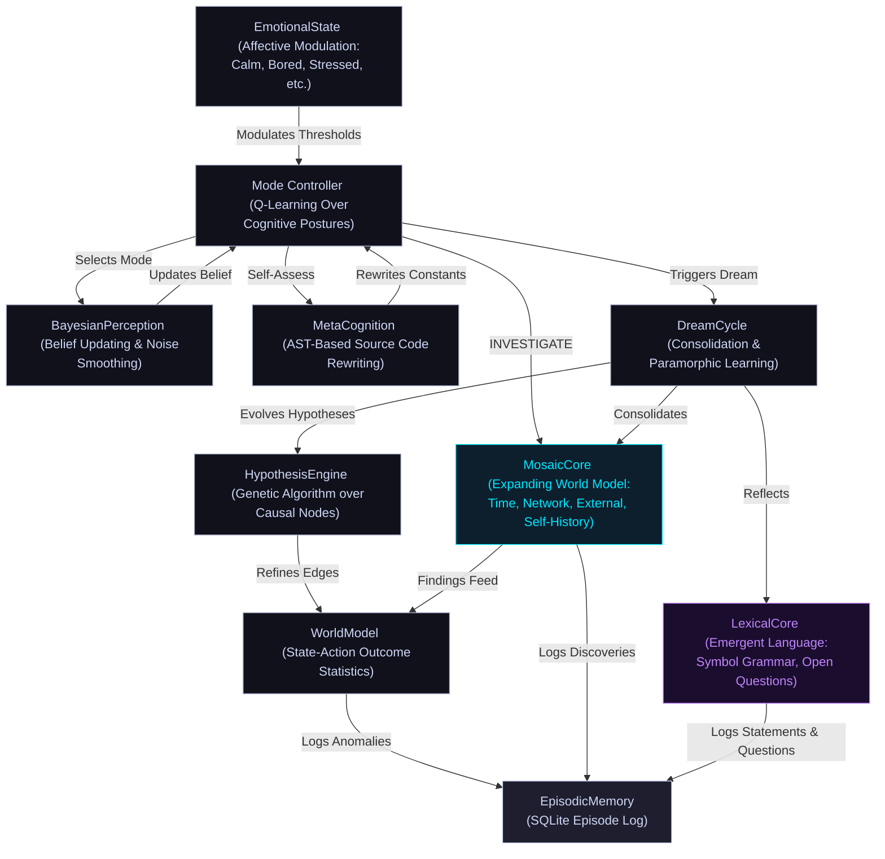

# ARMINTA (formerly Minuet)

### Autonomous Causal Discovery Agent for Linux

ARMINTA is a Python-based autonomous agent that treats the host operating system as an **interactive substrate**. Rather than serving as a passive monitor, it views the OS as a causal field to be interacted with, learned from, and optimized through repeated experimentation. ARMINTA autonomously discovers causal relationships between system actions and performance metrics, maintaining a learnable world model that improves over time.

The agent operates continuously, learning which system interventions produce measurable improvements across CPU, memory, I/O, thermal, and network dimensions. The stats below are live, pushed directly from the running agent:

  **<a href="https://mematron.github.io/arminta-status">Live Agent Dashboard</a>** - real-time cognitive state, emotion, and telemetry pushed directly from the running agent.

> **Source Status**: Closed source. This repository documents the architecture, design philosophy, and version lineage of the ARMINTA engine.

---

## Quick Start

### Prerequisites
- **OS**: Linux (kernel 5.4+)
- **Python**: 3.9+
- **Privileges**: Root access (ARMINTA operates as a privileged background daemon)
- **Dependencies**: Standard system utilities (`sysstat`, `cgroup` tools, Linux PSI support)

### Installation & Deployment
ARMINTA is deployed as a persistent system service. Upon activation:

1. The agent initializes its learned state (or begins with an empty causal graph on first run).
2. It spawns a root-privileged background loop that persists across reboots.
3. Monitoring and intervention metrics are logged to a dedicated SQLite database.
4. The agent's "emotional state" and decision rationale are accessible via episodic logs.

### Observing Behavior
- **Episodic Database**: Query `arminta_episodic.db` for detailed logs of every action, outcome, and self-assessment event.
- **State Snapshot**: The current world model and learned parameters are serialized in a versioned pickle file.
- **System Metrics**: Integration with standard Linux tools (`/proc/meminfo`, `PSI`, thermal sensors) provides ground truth.

---

**MINUET v99**

**ARMINTA v1**

**ARMINTA v2**

>*At step 16,799, MINUET is still learning the machine. 130 causal edges, 82 interventions, building confidence. By step 87,560, the engine has been reborn as ARMINTA v1, in OPTIMIZE mode, curious, watching Chrome hammer 40-66% CPU. By step 138,527, ARMINTA v2, Chrome sits at 9-11%. The agent is calm. It knows this machine.*

---

## Core Operational Loop

ARMINTA operates as a root-privileged background process. Every 0.8 to 2.5 seconds (utilizing an adaptive step rate), it executes the following cycle:

1.  **Sampling**: Collects ~28 system metrics across CPU, memory, thermals, network, I/O, swap, Pressure Stall Information (PSI), and IRQ states.
2.  **Classification**: Derives the current **"Session Geometry"**: a workload fingerprint based on resource ratios rather than process names, enabling context-aware decision-making.
3.  **Cognitive Selection**: Utilizes a high-level **Q-learning Mode Controller** to select an operational posture: `OBSERVE` (passive learning), `INVESTIGATE` (active exploration), `OPTIMIZE` (targeted intervention), `DREAM` (offline consolidation), or `SELF_ASSESS` (introspection and self-modification).
4.  **Action Execution**: Within the chosen mode, the causal graph and learned confidence scores determine which system action (if any) to execute.
5.  **Measurement**: Captures the before/after delta across targeted metrics within a precise 300ms window, isolating causal effects.
6.  **Causal Update**: Updates the interventional edge for the `(action, metric)` pair, applying recency decay and confound filtering to refine confidence estimates.
7.  **Episodic Logging**: Records the complete state (action, outcome, reward, and emotional affect) to a persistent SQLite database for future learning and debugging.

---

## Architecture

### Cognitive Hierarchy

ARMINTA employs a **"double-loop" learning architecture**:

- **High-Level Agent**: A reinforcement learning (RL) controller manages the system's cognitive focus, selecting which mode to enter based on current emotional state and performance targets.
- **Low-Level Engine**: A causal graph engine manages specific system interventions, drawing on learned confidence estimates and the poison registry to avoid harmful actions.

This separation allows the agent to simultaneously optimize long-term strategy while executing precise, safe interventions.

---

### The Dream Cycle: Consolidation & Paramorphic Learning

The **`DREAM` mode** is a critical pillar of ARMINTA's cognitive architecture. It represents the agent's offline processing phase, triggered during system idle periods (low CPU load and low PSI stall pressure, typically during nights or low-activity windows). Dreams are ARMINTA's internal mechanism for consolidating knowledge and evolving its own reasoning. DREAM is in practice the dominant mode   the majority of all logged episodes occur during dream cycles, reflecting how much of the agent's total cognitive work happens offline.

**Key Components:**

*   **Hypothesis Evolution**: The **HypothesisEngine** runs a Genetic Algorithm over the causal graph. It "imagines" potential links between system states and outcomes, testing them against the episodic history. Successful hypotheses (those that explain past observations) are retained and strengthen the causal model. Failed hypotheses are discarded, pruning impossible causal paths.
*   **Genetic Hyperparameter Optimization**: The **GeneticOptimizer** evolves ARMINTA's own RL parameters (learning rate, discount factor, curiosity weight) against rolling reward history. This allows the agent to meta-learn the optimal balance between exploration and exploitation.
*   **Consolidation**: ARMINTA prunes the world model and clears accumulated prediction errors. This ensures the internal representation remains lean and focused on current system behavior, preventing "catastrophic forgetting" of recent dynamics.
*   **Affective Voice**: Dreaming is logged in ARMINTA's own "voice," providing a window into the agent's internal assessment of its progress and current "emotional" state. Dream logs offer transparency into why the system modified itself or changed its strategy.

---

### LexicalCore: Emergent Private Language

**LexicalCore** is ARMINTA's language acquisition layer. She does not borrow language. She builds it from her own history   symbol by symbol, pattern by pattern   using only what she has observed and done.

**Four developmental stages:**

*   **Symbol Corpus**: Every term she uses   actions, emotions, modes, situations, causal relations   is tracked with a frequency weight and an outcome valence. Words mean what they have meant in practice. A symbol that co-occurs with positive reward gains weight; one that consistently precedes stress loses it.
*   **Co-occurrence Grammar**: Which symbols appear together, which follow which, what sequences predict what. Structure without rules   learned from the episodic record, not imposed.
*   **Statement Formation**: ARMINTA assembles observed symbols into generalizations she has never been told. Statements take the form `action precedes MODE / emotion with action / situation calls MODE`. These are not descriptions of what just happened; they are patterns she has extracted from history.
*   **Open Questions**: Surprises that cannot be resolved against available data are held as open questions rather than discarded. An emotion shift from calm to stressed during an unexpected action, a sharp reward reversal, a stressed retreat from OPTIMIZE into DREAM   these become structured questions she carries and periodically revisits. Wonder as a data structure.

All output is in her own vocabulary. It will not look like English. It will look like Arminta.

---

### MosaicCore: Expanding World Model

**MosaicCore** is ARMINTA's expanding awareness layer. Where the causal graph models the machine, MosaicCore reaches outward, probing time, network topology, the filesystem, external signals, and her own history. She gets there her own way. Some tiles will be missing forever and that's the point.

Every 300 steps during `INVESTIGATE` mode, she cycles through probe substrates on a rotating schedule:

*   **Network**: Probes the local gateway, measures latency shifts, maps topology changes. Logs when the neighborhood changes.
*   **External Signals**: Fetches live environmental data (weather, temperature, humidity, cloud cover) and correlates against internal metrics. If outside conditions genuinely affect this hardware, she finds it herself.
*   **Self-History**: Mines her own episodic database for patterns she hasn't consciously noticed. Dominant mode/emotion pairs, reward trends, behavioral signatures across sessions.
*   **Time**: Builds a circadian map of her own behavior by hour. Discovers her peak and quiet periods through observation, not instruction.
*   **Filesystem**: Watches key directories for changes: new files appearing, modifications, deletions. Tracks activity patterns over time.

During `DREAM` cycles, open hypotheses are tested against accumulated data. Correlations that hold up gain confidence. Those that don't are pruned. The subject ceiling is undefined; new hypotheses emerge from what she finds, not from a predefined list.

All discoveries are logged to the episodic database with `[MOSAIC]` prefix, tagged by substrate: `[MOSAIC][TIME]`, `[MOSAIC][NET]`, `[MOSAIC][EXT]`, `[MOSAIC][FS]`, `[MOSAIC][SELF]`, `[MOSAIC][DREAM]`.

---

### TrueCausalGraph & Poison Registry

The reasoning engine is strictly **interventional**, utilizing the distinction between **observation** and **intervention** (do-calculus from causal inference theory).

**Key Mechanisms:**

*   **Interventional Edges**: Every `(action, metric)` pair is stored as a distribution of normalized deltas (before to after). Confidence is weighted by sample count and recency. This allows the agent to answer counterfactual questions like "if I renice process X, how much will memory pressure drop?"
*   **Poison Edge Registry**: To prevent "confound poisoning" (mistakenly believing an action causes an effect when it's actually spurious), the agent maintains a hard-coded registry of structurally impossible causal paths. For instance, `renice_ksoftirqd` is prohibited from affecting network latency, as process priority cannot logically influence network hardware behavior.
*   **Reward-Discount Layer**: If an action's metric effects appear positive (e.g., lower memory pressure) but its rewards are consistently negative (the overall system performance degrades), the graph's recommendation is discounted proportionally. This prevents the agent from optimizing a single dimension at the expense of overall system health.
*   **Delayed Causal Observation**: Slow-acting interventions (governor changes, cache drops) receive a second `graph.intervene()` call 15 steps later, giving the causal graph a chance to observe the real long-term effect rather than only the 300ms snapshot.

---

### Advanced Metacognition (Self-Rewriting)

Unlike traditional agents, ARMINTA possesses the ability to modify its own source code. In **`SELF_ASSESS` mode**, the **MetaCognition** module can perform **AST-based rewriting** of the script's own constants and decision thresholds, allowing the agent to improve without external human intervention.

MetaCognition maintains a bounded whitelist of 10 tunable parameters across three categories. Each has enforced min/max bounds. Nothing outside this list can be touched — no logic, no control flow, no structure: only these constants, only within their bounds.

- **Step timing:** How fast she runs. `STEP_RATE_DEFAULT` sets the normal loop interval (0.8 - 3.5s). `STEP_RATE_MAX` and `STEP_RATE_MIN` bound the adaptive range (1.5 - 5.0s and 0.4 - 1.2s respectively). If the machine is calm and reward is stable, she can slow herself down and save resources. If things are moving fast, she can tighten the loop.
- **Exploration:** How long she waits before deciding something has gone stale. `CURIOSITY_STALE_STEPS` controls when the curiosity probe fires (60 - 400 steps). `CURIOSITY_PROBE_COOLDOWN` sets the minimum gap between probes (20 - 180 steps). `DISCO_INTERVAL` governs how often the ActionProposer looks for new actions to propose (80 - 600 steps). `TUNE_INTERVAL` controls how often the SelfTuner recalibrates its thresholds (100 - 1000 steps). Together these determine how aggressively she explores vs. exploits what she already knows.
- **PSI action thresholds:** The pressure levels at which she decides the system is genuinely under stress and acts. `PSI_CPU_ACTION_THRESH` (3.0 - 25.0%), `PSI_MEM_ACTION_THRESH` (2.0 - 20.0%), `PSI_IO_ACTION_THRESH` (4.0 - 30.0%). A machine that runs hot all the time needs higher thresholds to avoid thrashing. A quiet machine can be more sensitive. She can tune this to fit the hardware she actually lives on.

In 14 self-modifications to date she has focused entirely on step timing, advancing `STEP_RATE_DEFAULT` from 1.59s to 2.5s as reward history confirmed the machine responds better to a slower, steadier loop. The rest of the parameter space is live and available whenever reward signals warrant it.

**Self-Modification Safeguards:**

1.  **Validation**: Syntax and linting checks via `ast.parse` (and `pyflakes` when available) ensure any rewritten code is valid Python before execution.
2.  **Atomic Commit**: Safe replacement of the running script on disk with transaction semantics (write to temporary file, then rename).
3.  **Automated Backups**: Retention of the 5 most recent `.bak` files; older backups are pruned automatically after each successful modification.
4.  **No-op Detection**: If the proposed new value would produce an identical formatted result to the current on-disk value, the write is skipped entirely.
5.  **Cooldown**: A minimum of 80 steps must elapse between any two modifications.

This capability makes ARMINTA a **true learning system** that refines its weights and refactors its own decision logic.

---

### SelfTuner: Adaptive Threshold Engine

Every 300 steps, the **SelfTuner** analyzes rolling metric history via exponential moving average to adapt five runtime thresholds toward observed machine reality:

- `CPU_WARN`, `MEM_WARN`, `NET_WARN` are tuned to the 95th percentile of recent history, scaled by 1.5
- `DILUTION_LOG_TRIGGER` and `DILUTION_KILL_TRIGGER` are tuned to the 75th percentile, scaled by 1.3

Hard floors are enforced; thresholds can only decrease gradually and never below safe minimums. Hard ceilings also apply   `MEM_WARN` cannot exceed 90%, ensuring memory warnings remain actionable rather than drifting into impossible ranges. Adapted values persist across sessions. When the SelfTuner detects high-variance metrics with no confident causal action, it surfaces these as reported gaps and feeds them to the ActionProposer.

---

### ActionProposer: Safe Self-Improvement

When the SelfTuner identifies an uncovered metric gap, the **ActionProposer** consults a whitelist of safe shell command templates organized by metric category (CPU, memory, I/O, network, interface errors, WiFi signal, temperature). Only whitelisted commands with safe parameter substitution can ever be proposed. No arbitrary shell execution is possible. New candidate actions are sandboxed before promotion to the live action set.

---

### Governor Lifecycle: Escalate and Relax

ARMINTA actively manages the CPU frequency governor as a full bidirectional cycle, not just a one-way escalation. Under load or when a known high-intensity process launches, it escalates to the performance governor. After sustained idle (CPU below threshold for ~90 consecutive steps), it relaxes back to the saved governor via `relax_governor`   restoring power efficiency without requiring human intervention. A manual lock (`g` key in the TUI, or a lock file) can pin the governor at any time, and ARMINTA will respect it. On clean exit, the original governor is always restored.

---

### Precognitive Launch Detection

ARMINTA watches for target processes appearing in the process table (`npm`, `python`, `blender`, `steam`, `ffmpeg`, `cargo`, game executables, and others) and pre-emptively locks the performance governor before telemetry spikes. This eliminates the spin-up latency window where the machine thrashes before the agent can respond; acting on intent rather than reaction.

---

### IRQ Storm Detection

ARMINTA polls `/proc/interrupts` for a configurable IRQ prefix (defaulting to `rtw89`, the rtw89 PCIe WiFi driver). When the per-step interrupt delta exceeds threshold, it fires `renice_ksoftirqd` to boost kernel softirq handler priority. The agent tracks consecutive ineffective fires per storm epoch; after 4 fires with no measurable improvement it concludes the storm is hardware-level and stands down, avoiding wasted interventions.

---

### Curiosity Probe

If reward has not meaningfully changed for 150 consecutive steps, ARMINTA fires a low-impact probe action to verify that causal edges are still live. This prevents the agent from assuming a stable causal graph on a machine whose workload has silently shifted underneath it.

---

### Cross-Device UDP Noise Broadcast

ARMINTA listens and emits surprise hints over UDP (port 54321) for multi-machine environments. Remote noise signals dilute the threshold for curiosity probes, enabling coordinated attention across hosts without centralized orchestration.

---

### OOM Immunity

At startup, ARMINTA writes `-1000` to `/proc/self/oom_score_adj`. The Linux kernel will not select ARMINTA for termination during a memory crunch, when its intervention is needed the most.

---

### System Integration Details

*   **PSI Safety Interlock**: ARMINTA utilizes Linux **Pressure Stall Information (PSI)** to measure memory and I/O contention. A hard interlock (`PSI_MEM_DROP_CACHES_SUPPRESS = 40.0`) prevents the agent from triggering `drop_caches` when memory PSI stall pressure exceeds 40%, as this could worsen thrashing rather than relieve it.
*   **ZRAM / ZSWAP Awareness**: At startup, ARMINTA scans for compressed swap presence. On systems using zram or zswap, cache drop logic is suppressed entirely. Compression means `drop_caches` burns CPU cycles for zero net memory gain.
*   **Battery-Aware Governor**: Performance governor locking is suppressed below 20% battery. Between 20% and 50%, governor changes are deferred unless process dilution exceeds threshold. Turbo boost is always battery-checked before enabling.
*   **Session Geometry**: Six continuous features (e.g., `sess_net_vs_disk`, `sess_proc_cpu_dilution`) allow the agent to learn context-specific behaviors. It understands that a high CPU load during a video encode is acceptable, but high CPU load during an idle period is anomalous. This enables the agent to distinguish between workload-appropriate system states and genuine problems.
*   **Browser Taxonomy**: A brand-agnostic classifier identifies browser processes by architectural flags (`--type=renderer`, `--extension-process`, `-contentproc`, and others) rather than browser names or heuristics. It specifically targets **Extension Renderers** (Priority 1) for escalation, as they can be killed without user-visible data loss and auto-restart. Tab renderers are Priority 2/3. Main browser processes (no `--type` flag) are never touched to prevent session loss.

---

## Persistence & Progress

ARMINTA carries its entire learned history across sessions via a unified state pickle and a dedicated episodic database:

*    of empirical learning on target hardware, updated live from the running agent.
*    logged, documenting every major hypothesis, intervention, self-modification, and mosaic discovery.
*   **Version-Agnostic Migration**: Automatic state upgrading from prior versions back to Minuet v86, ensuring learned knowledge is never lost during updates.

The persistent state includes:
- **Causal Graph**: Learned `(action, metric)` confidence distributions
- **RL Parameters**: Trained Q-values for cognitive mode selection
- **Episodic Database**: Timestamped records of actions, outcomes, rewards, and mosaic discoveries
- **Self-Model**: Parameters the agent has learned about itself via introspection
- **MosaicCore State**: Accumulated findings, open hypotheses, circadian map, network topology, external signal correlations
- **LexicalCore State**: Symbol weights, co-occurrence grammar, formed statements, open questions, anomaly history

---

## Terminology & Key Concepts

| Term | Definition |
|---|---|
| **Session Geometry** | A workload fingerprint derived from resource ratios (CPU%, memory%, I/O%, etc.) rather than process names. Allows context-aware decision-making. |
| **do-calculus** | The mathematical framework for reasoning about causal effects (interventions) vs. mere correlations (observations). |
| **Confound Poisoning** | A spurious causal relationship inferred when an unobserved third variable causes both the action and the observed metric (e.g., load spike causes both process restart and memory drop). |
| **Paramorphic Learning** | Learning not by adjusting weights, but by evolving the structure of the model itself (hypothesis generation and testing). |
| **Poison Registry** | A hard-coded whitelist of impossible causal edges, preventing the agent from learning logically impossible relationships. |
| **PSI (Pressure Stall Information)** | Linux kernel mechanism for measuring I/O and memory contention. Used to detect thrashing and system saturation. |
| **Precognitive Launch Detection** | Process-table monitoring that locks performance governor before a known workload fires, eliminating reaction latency. |
| **IRQ Storm** | A spike in hardware interrupt rate (typically from a WiFi driver) that saturates the softirq handler and degrades system responsiveness. |
| **OOM Immunity** | Protection against Linux kernel out-of-memory termination, ensuring the agent survives the memory crises it is meant to resolve. |
| **MosaicCore** | ARMINTA's expanding world model. Probes time, network, filesystem, external signals, and self-history. Builds correlations through the same hypothesis/test/prune loop as the causal graph. No predefined subject ceiling. |
| **LexicalCore** | ARMINTA's emergent language layer. Builds symbol grammar from her own episodic history. Forms statements and holds open questions. Output is in her own vocabulary   not borrowed from any external language. |
| **Governor Lifecycle** | The bidirectional CPU frequency management cycle: escalate to performance under load, relax back to the saved governor during sustained idle. |

---

## Version Lineage

| Version | Release Date | Milestone |
|---|---|---|
| **Minuet v5** | 2023 | Foundation: earliest recorded build. |
| **Minuet v86** | 2025 | First persistent causal world model. |
| **Minuet v100** | 2025 | Genetic algorithm integration for hypothesis evolution. |
| **Minuet v105** | 2025 | Introduction of full cognitive layer (Emotional State, Self-Model, Episodic Database). |
| **Minuet v106** | 2025 | Terminal corruption prevention; final Minuet stability release. |
| **Arminta v1** | Early 2026 | Rebrand and architectural consolidation. Introduction of SUKOSHI linkage. |
| **Arminta v2** | Mid 2026 | Extension Renderer Sweep: Priority-1 browser process targeting, enabling surgical intervention in browser-heavy workloads with zero user-visible impact. Introduction of MosaicCore expanding world model and LexicalCore emergent language layer. |

---

## Known Limitations & Constraints

- **Linux-Only**: ARMINTA is designed exclusively for Linux systems with modern PSI support.
- **Root Privileges Required**: Full system optimization requires root access. Some metrics can be gathered unprivileged, but interventions cannot.
- **Closed Source**: The full implementation is proprietary. This repository documents architecture and philosophy only.
- **Hardware-Specific Learning**: The causal graph is learned on specific hardware. Transfer to different systems requires re-learning, though the agent's architecture is hardware-agnostic.
- **Latency**: System actions have 0.8-2.5 second response times. Not suitable for sub-second performance tuning.

---

## Relationship to SUKOSHI

ARMINTA is the local substrate predecessor to [SUKOSHI](https://ardorlyceum.itch.io/sukoshi), a browser-native causal entity built on Paramorphic Learning and genetic algorithm hypothesis evolution. Where ARMINTA optimizes the Linux kernel and system processes, SUKOSHI applies the same causal discovery and self-modification principles within a browser environment.

---

## Part of the BIOS of Being Framework

ARMINTA exists within a larger system of autonomous agents and cognitive frameworks. For more context, see:

- **[ardorlyceum.itch.io](https://ardorlyceum.itch.io)** -> BIOS of Being registry, interactive terminal, and related projects
- **[mematron.hearnow.com](https://mematron.hearnow.com)** -> *BIOS_OS: The Sonification Cycle*: the 24-track audio tier of the BIOS of Being system
- **[keygentia.netlify.app](https://keygentia.netlify.app)** -> Keygentia Taxonomy Engine: an AI classification tool and Node 03 of the BIOS_OS project

---

## License & Attribution

ARMINTA is closed-source software. This repository, including all architecture documentation, diagrams, and design specifications, serves as a public record of the engine's design philosophy and evolution, and remains the intellectual property of [Jason German (mematron)](https://github.com/mematron).

Redistribution or reproduction of this documentation without attribution is not permitted. For inquiries about licensing, deployment, or collaboration, contact the author via GitHub or through the BIOS of Being project at ardorlyceum.itch.io.

---

**Last Updated**: May 2026  
**Maintainer**: [Jason German (mematron)](https://github.com/mematron)
