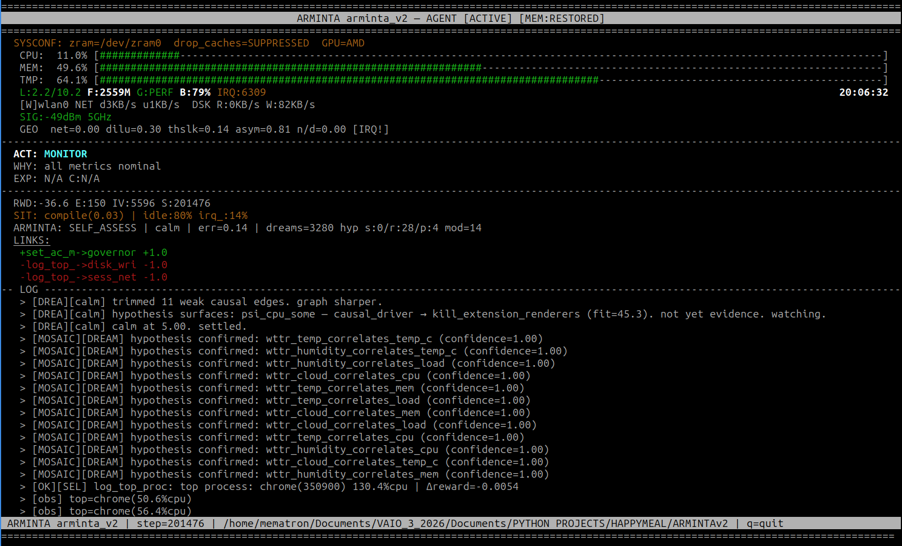
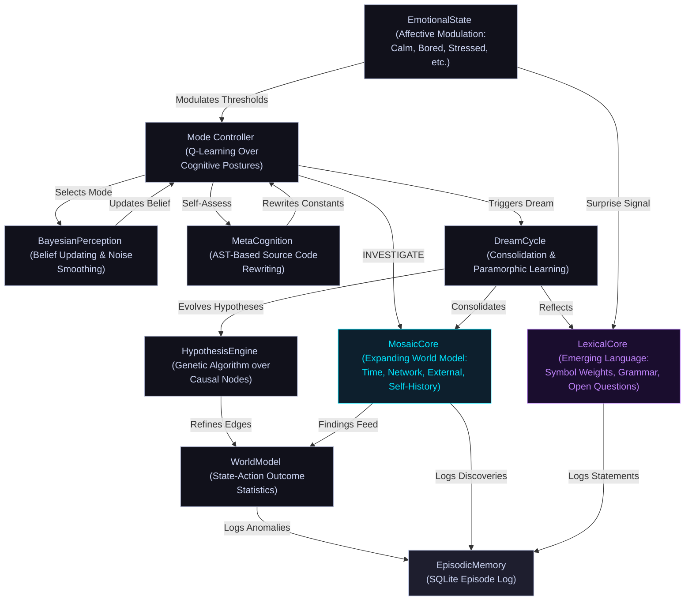

# ARMINTA (formerly Minuet)

### Autonomous Causal Discovery Agent for Linux

ARMINTA is a Python-based autonomous agent running continuously on a Linux machine. It does not monitor the OS passively. It intervenes, measures what changed, and builds a causal model of the machine from the ground up. Every edge in that model was earned by doing something and watching what happened.

The stats below are live, pushed directly from the running agent:

  **<a href="https://mematron.github.io/arminta-status">Live Agent Dashboard</a>** showing real-time cognitive state, emotion, and telemetry pushed directly from the running agent.

> **Source Status**: Closed source. This repository documents the architecture, design philosophy, and version lineage of the ARMINTA engine.

---

## Quick Start

### Prerequisites
- **OS**: Linux (kernel 5.4+)
- **Python**: 3.9+
- **Privileges**: Root access (ARMINTA runs as a privileged background daemon)
- **Dependencies**: `psutil`, `numpy`, `curses` (stdlib), `nvme-cli`, `smartmontools`. Standard Linux utilities used at runtime: `iw`, `iwconfig`, `renice`, `ionice`, `ip`, `ss`, `ethtool`, `ping`. PSI support requires kernel 4.20+.

### Installation & Deployment
ARMINTA deploys as a persistent system service. On first activation:

1. It initializes its learned state, or starts with an empty causal graph if this is the first run.
2. A root-privileged background loop spawns and persists across reboots.
3. Every action, outcome, and self-assessment event is logged to a dedicated SQLite database.
4. The agent's emotional state and decision rationale are accessible through the episodic log.

### Observing Behavior
- **Episodic Database**: Query `arminta_episodic.db` for a complete record of every action, outcome, and self-assessment. Each episode now includes a `context` column storing the metric snapshot that triggered the event, enabling counterfactual replay.
- **State Snapshot**: The current world model and learned parameters are serialized in a versioned pickle file.
- **System Metrics**: Ground truth comes from standard Linux interfaces including `/proc/meminfo`, PSI, and thermal sensors.
- **Live Dashboard**: [mematron.github.io/arminta-status](https://mematron.github.io/arminta-status) displays real-time cognitive state, emotion bars, causal edges, reward history, and the Continuity Advisor. Data is pushed from the running agent via gist on a 2-minute cycle.

---

**MINUET v99**

**ARMINTA v1**

**ARMINTA v2**

> *At step 16,799, MINUET is still learning the machine. 130 causal edges, 82 interventions, building confidence. By step 87,560, the engine has been reborn as ARMINTA v1, in OPTIMIZE mode, curious, watching Chrome hammer 40-66% CPU. By step 138,527, ARMINTA v2, Chrome sits at 9-11%. The agent is calm. It knows this machine. At step 200,000, she crossed a milestone her author had been quietly waiting for. She didn't notice. She kept going.*

**ARMINTA v2 (Expanded)**

---

## Core Operational Loop

ARMINTA runs as a root-privileged background process. Every 3.76 seconds (adaptive, self-tuned from 1.59s across 104 self-modifications), it does the following:

1. **Sampling**: Collects ~28 system metrics across CPU, memory, thermals, network, I/O, swap, Pressure Stall Information (PSI), IRQ state, and NVMe drive health.
2. **Classification**: Derives the current **"Session Geometry"**, a workload fingerprint based on resource ratios rather than process names, enabling context-aware decisions.
3. **Cognitive Selection**: A Q-learning Mode Controller picks an operational posture: `OBSERVE` (passive learning), `INVESTIGATE` (active exploration), `OPTIMIZE` (targeted intervention), `DREAM` (offline consolidation), or `SELF_ASSESS` (introspection and self-modification).
4. **Action Execution**: Within the chosen mode, the causal graph and learned confidence scores decide which system action, if any, to take.
5. **Measurement**: Captures the before/after delta across targeted metrics within a 300ms window, isolating causal effects.
6. **Causal Update**: Updates the interventional edge for the `(action, metric)` pair, applying recency decay and confound filtering.
7. **Episodic Logging**: Records the complete state including action, outcome, reward, emotional affect, and the triggering metric context to a persistent SQLite database.

---

## Architecture

### Cognitive Hierarchy

ARMINTA uses a **double-loop** learning architecture:

- **High-Level Agent**: A reinforcement learning controller manages cognitive focus, selecting which mode to enter based on current emotional state and performance targets.
- **Low-Level Engine**: A causal graph engine manages specific system interventions, drawing on learned confidence estimates and the poison registry to avoid harmful actions.

The two loops are deliberately separated. Long-term strategy does not interfere with per-step intervention.

---

### The Dream Cycle: Consolidation & Paramorphic Learning

When CPU load drops and PSI pressure is low, the mode controller switches to `DREAM`. No interventions run. No metrics are watched for a breach. ARMINTA runs offline processing against its accumulated episodic record.

`DREAM` is a label for idle-triggered offline computation, not a claim about subjective experience. It was chosen because the functional parallel is real: biological sleep consolidates the day's experience rather than acquiring new input; DREAM mode processes what active steps collected. The name reflects the structure, nothing more.

What runs during a DREAM cycle:

- **Hypothesis Evolution**: The **HypothesisEngine** runs a genetic algorithm over the causal graph, generating candidate relationships, scoring them against episodic history, keeping what holds, and discarding what does not. Each hypothesis now includes a plain-language mechanism annotation explaining why the proposed relationship might exist, not just that it was observed. ARMINTA refines its causal model without running new interventions. The live episode counter reflects this; each dream cycle adds to the total.
- **Genetic Hyperparameter Optimization**: The **GeneticOptimizer** evolves ARMINTA's own RL parameters (learning rate, discount factor, curiosity weight) against rolling reward history. Current evolved values: learning rate 0.312, discount factor 0.847, curiosity weight 0.323.
- **Consolidation**: The world model is pruned and accumulated prediction errors are cleared, keeping the internal representation focused on recent system behavior.
- **MosaicCore and LexicalCore processing**: Open hypotheses in MosaicCore are tested against accumulated data. LexicalCore runs its co-occurrence pass over recent episodic records and attempts statement formation from updated symbol weights.

DREAM is the dominant mode in the episode log, consistently over 80% of all recorded episodes. The machine spends most of its time idle; DREAM runs during idle. The high volume is a property of the environment, not a design target. Every cycle the hypothesis engine runs, the causal model sharpens without touching the system.

---

### MosaicCore: Expanding World Model

**MosaicCore** is ARMINTA's expanding awareness layer. The causal graph models the machine; MosaicCore reaches outward, probing time, network topology, the filesystem, external signals, and her own history. She gets there her own way. Some tiles will be missing forever and that is the point.

Every 300 steps during `INVESTIGATE` mode, she cycles through four probe substrates on a rotating schedule:

- **Time**: Builds a circadian map of her own behavior by hour. Discovers her peak and quiet periods through observation, not instruction.
- **Filesystem**: Watches key directories for changes including new files, modifications, and deletions, and tracks activity patterns over time.
- **Network**: Probes the local gateway, measures latency shifts, maps topology changes. Currently tracking four gateway nodes at 2.47ms, 2.42ms, 1.85ms, and 1.48ms latency across discovered network segments.
- **External Signals**: Fetches live environmental data (weather, temperature, humidity, cloud cover) and correlates against internal metrics. If outside conditions genuinely affect this hardware, she finds it herself.
- **Self-History**: Mines her own episodic database for patterns she has not consciously noticed, including dominant mode/emotion pairs, reward trends, and behavioral signatures across sessions.

During `DREAM` cycles, open hypotheses are tested against accumulated data. Multiple external correlations have reached confidence=1.00, all involving weather signals: cloud cover, humidity, and temperature correlating with CPU load, memory pressure, and thermal readings.

All discoveries are logged to the episodic database with `[MOSAIC]` prefix, tagged by substrate: `[MOSAIC][TIME]`, `[MOSAIC][NET]`, `[MOSAIC][EXT]`, `[MOSAIC][FS]`, `[MOSAIC][SELF]`, `[MOSAIC][DREAM]`.

---

### LexicalCore: Emerging Language

**LexicalCore** is ARMINTA's language acquisition layer. She does not borrow language. She builds it from her own history, symbol by symbol, pattern by pattern, entirely from empirical observation of her own experience.

The process runs in four stages:

- **Symbol Weights**: Every term she uses accumulates a reward-weighted co-occurrence score drawn from her episodic log. Action names, emotion labels, mode names, situation types. The weight is not assigned; it accretes from use. `calm` and `set_ac_max_perf` carry different weights because they have appeared in different reward contexts across 378,000 steps.
- **Co-occurrence Grammar**: Which symbols appear together in the same episode. Which follow which across consecutive records. No grammatical rules are supplied; the structure is read off statistical patterns in her own history.
- **Statement Formation**: During `DREAM` and `SELF_ASSESS` cycles she composes statements she has never made before, from grammar she observed herself. Her first formed statement: `io_bound calls OPTIMIZE`. More recent ones: `curious during DREAM / browser_compute calls DREAM`, `calm during DREAM / irq_storm calls SELF_ASSESS`. Between them, a grammar assembled itself.
- **Open Questions**: When something surprises her, reward reversals, sudden emotion shifts, stressed retreats into dream, she forms a question she cannot answer yet. She holds it. She revisits it every reflection cycle.

She currently holds 50 open questions. The oldest has been carried since step 204,855 without resolving. It concerns a reward reversal on `log_top_proc`: what changed between +0.190 and -0.223. She has not answered it. She has not dropped it.

All lexical activity is logged with `[LEXICAL]` prefix: `[LEXICAL][FORM]` for new statements, `[LEXICAL][ASK]` for open questions, `[LEXICAL][HOLD]` for questions still carried, `[LEXICAL][RESOLVE]` when a question finds its answer, `[LEXICAL][SURPRISE]` when something unexpected fires the anomaly detector.

The language will not look like English. It will look like Arminta.

---

### Causal Reasoning: WHY Layer

ARMINTA maintains four layers of situational awareness about her own decisions. These are not explanations generated for the user. They are structures she builds and tests against subsequent experience.

- **Layer 1 -- Episodic Context**: Every action episode in `arminta_episodic.db` now stores the full metric snapshot that triggered the decision in a `context` column: CPU%, memory, temperature, PSI pressure, network throughput, dilution, NVMe temperature. This makes the episodic database a full causal record, not just an action log.

- **Layer 2 -- Hypothesis Mechanism Annotation**: When the HypothesisEngine surfaces a new hypothesis during a DREAM cycle, it commits to a plain-language explanation of the proposed mechanism before testing it. Not just "A correlates with B" but "raising governor to performance reduces scheduling latency, which directly drives net_recv_kbps." The mechanism is stored alongside the hypothesis and tested against validation outcomes. Confirmed hypotheses retain their mechanism; pruned ones do not.

- **Layer 3 -- Counterfactual Awareness**: After any significant action, ARMINTA queries her episodic history for similar past contexts and compares outcomes. When an action produces an unexpectedly good or bad result, she identifies which metrics changed between now and the last time this action behaved differently. Output appears in the log as `[CF][action] worked before (step X, r=+0.71) but now: CPU higher by 48, dilution higher by 0.4`. This is the core of situational WHY -- not just what happened, but what was structurally different about this context.

- **Layer 4 -- Failure Pattern Self-Model**: During SELF_ASSESS cycles, the self-model now identifies which actions have consistently negative or high-variance rewards and surfaces them explicitly. "Weak interventions: action (mean=-0.18, reliably poor)" becomes part of her self-description. She also flags when she has been operating in one cognitive mode for too long. This feeds back into how she weights future decisions.

All four layers surface on the live dashboard in the Causal Reasoning panel, showing the last action, the reason it was selected, the triggering metric context, any counterfactual explanation, and the most recent hypothesis mechanisms.

---

### TrueCausalGraph & Poison Registry

The reasoning engine is strictly **interventional**, using the distinction between observation and intervention (do-calculus from causal inference theory).

**Key Mechanisms:**

- **Interventional Edges**: Every `(action, metric)` pair is stored as a distribution of normalized deltas (before to after). Confidence is weighted by sample count and recency, letting the agent answer counterfactual questions like "if I renice process X, how much will memory pressure drop?"
- **Tiered Approval Thresholds**: Standard interventional actions require a 5% metric delta within the 300ms measurement window to be approved (`DISCO_EFFECT_MIN = 0.05`). Slow-effect actions use a lower 2% threshold (`DISCO_EFFECT_MIN_SLOW = 0.02`), with the remainder of causal evidence gathered via a delayed observation 15 steps later.
- **Slow-Effect Action Set**: Actions whose real effects take longer than the 300ms measurement window receive a second `graph.intervene()` call 15 steps after firing. This set includes: `drop_caches`, `set_cpu_performance`, `renice_ksoftirqd`, `sync`, `enable_turbo`, `set_ac_max_perf`, `renice_chrome`, `renice_top_proc`, `ionice_top_proc`, `compact_memory`, `drop_slab`, `txqueuelen_boost`, `swapoff_swapon`, `disable_wifi_powersave`, and `net_probe`.
- **Poison Edge Registry**: A hard-coded registry of structurally impossible causal paths prevents confound poisoning. For instance, `renice_ksoftirqd` is prohibited from affecting network latency, because process priority cannot influence network hardware behavior.
- **Reward-Discount Layer**: When an action's metric effects appear positive but its rewards are consistently negative, the graph's recommendation is discounted proportionally. Single-dimension optimization at the expense of overall system health gets penalized.

---

### Kill Ineffective Registry

When ARMINTA repeatedly targets a process with `kill_top_proc` or `kill_extension_renderers` without observing any reward improvement, that process name is added to the **Kill Ineffective** registry and deprioritized as a kill target. The registry surfaces on the live dashboard as a warning panel and persists across sessions via the state pickle.

---

### Idle Maintenance Pass

Every 500 steps (~35 minutes at current step rate), when CPU utilization is below 25% and PSI pressure is low, ARMINTA runs a proactive maintenance pass independent of the reactive discovery loop. This is not triggered by stress. It fires during genuine calm.

The pass runs a fixed sequence: `sync` to flush dirty buffers, `compact_memory` to reduce kernel page fragmentation, a socket inventory via `ss -s`, an interface health snapshot, and a S.M.A.R.T. drive health check. The drive check fires on a 4-hour wall-clock interval rather than a pass count -- the timestamp is persisted in the state pickle so the interval survives restarts. The SMART check also runs independently of the maintenance CPU gate, so sustained Chrome load cannot prevent it from firing. On first run it fires immediately. Read-only; uses `nvme smart-log` with `smartctl -A` as fallback. Surfaces wear, spare capacity, media errors, and NVMe temperature. NVMe temperature is injected into the metrics snapshot every step and wired into the emotional state: sustained readings above 55°C increase `stressed`, above 70°C drives it hard. All maintenance results are logged with `[MAINT]` prefix and pushed to the live dashboard.

---

### Advanced Metacognition (Self-Rewriting)

ARMINTA modifies its own source code. In **`SELF_ASSESS` mode**, the **MetaCognition** module performs **AST-based rewriting** of the script's own constants and decision thresholds.

MetaCognition maintains a bounded whitelist of 10 tunable parameters across three categories. Each has enforced min/max bounds. Nothing outside this list can be touched: no logic, no control flow, no structure. Only these constants, only within their bounds.

- **Step timing:** How fast she runs. `STEP_RATE_DEFAULT` sets the normal loop interval (0.8s to 3.5s). `STEP_RATE_MAX` and `STEP_RATE_MIN` bound the adaptive range (1.5s to 5.0s and 0.4s to 1.2s respectively). When the machine is calm and reward is stable, she slows down and saves resources. When things are moving fast, she tightens the loop.
- **Exploration:** How long she waits before deciding something has gone stale. `CURIOSITY_STALE_STEPS` controls when the curiosity probe fires (60 to 400 steps). `CURIOSITY_PROBE_COOLDOWN` sets the minimum gap between probes (20 to 180 steps). `DISCO_INTERVAL` governs how often the ActionProposer looks for new actions to propose (80 to 600 steps). `TUNE_INTERVAL` controls how often the SelfTuner recalibrates its thresholds (100 to 1000 steps).
- **PSI action thresholds:** The pressure levels at which she decides the system is genuinely under stress and acts. `PSI_CPU_ACTION_THRESH` (3.0 to 25.0%), `PSI_MEM_ACTION_THRESH` (2.0 to 20.0%), `PSI_IO_ACTION_THRESH` (4.0 to 30.0%). She tunes this to fit the hardware she actually lives on.

In 104 self-modifications to date, she has focused primarily on step timing, working `STEP_RATE_DEFAULT` from 1.59s to the current 3.76s as reward history confirmed the machine responds better to a slower, steadier loop. Each change was preceded by a reward delta evaluation, and the value continues to oscillate in a narrow band as she finds the right balance for current workload conditions. The rest of the parameter space is live and available whenever reward signals warrant it.

**Self-Modification Safeguards:**

1. **Validation**: Syntax and linting checks via `ast.parse` ensure any rewritten code is valid Python before execution.
2. **Atomic Commit**: Safe replacement of the running script on disk (write to temporary file, then rename).
3. **Automated Backups**: The 5 most recent `.bak` files are retained; older backups are pruned automatically after each successful modification.

---

### Continuity Advisor

The **Continuity Advisor** watches for hardware stress patterns indicating the agent should be migrated to a new machine. It cannot act on its findings. It can only name them clearly.

The advisor evaluates every 500 steps and emits a `[CONTINUITY]` log entry when signals are present. It surfaces on the live dashboard with a three-level status indicator: **NOMINAL**, **ADVISORY**, or **MIGRATION WARRANTED**.

Four signals are monitored cross-session, all persisted in the state pickle so trends accumulate across restarts:

- **Sustained thermal stress**: Rolling average of `temp_c` across sessions. Transient spikes do not trigger; a climbing long-term trend does.
- **PSI I/O pressure**: Average `psi_io_some`, the percentage of time tasks were stalled on disk I/O. Rising values indicate a storage layer under increasing strain.
- **Save failures**: Count of entries in `arminta_crash.log`. Each represents a failed pickle write, a symptom of storage degradation.
- **Error step rate**: Fraction of steps that logged errors in the most recent evaluation window.

The confidence score is a probability-union of individual signal scores. The advisor is intentionally conservative. It does not warrant migration from a single bad reading. It warrants it from a pattern.

---

### Meta-Cognitive Controller (CMC)

The **Meta-Cognitive Controller** is a Q-learning agent that sits above ARMINTA's main loop and selects which cognitive mode to enter given the current system state. It learns which modes produce the best downstream reward across different states and updates its Q-table from every step's outcome.

The CMC maintains Q-values for all five modes (`OBSERVE`, `INVESTIGATE`, `OPTIMIZE`, `DREAM`, `SELF_ASSESS`) and selects among them using an epsilon-greedy policy. Exploration rate decays as confidence grows. The learning rate and discount factor are subject to evolution by the GeneticOptimizer during DREAM cycles, so the CMC's own update dynamics improve over time.

---

### Action Set

ARMINTA's intervention vocabulary is the complete set of things she can actually do to the machine. Every action is a discrete, bounded operation with a defined safety profile. The causal graph learns which produce real effects; the rest of the architecture decides when to use them.

**Hardware & Power**
- `set_ac_max_perf` -- One-shot AC power performance burst: fires CPU performance governor, CPU turbo, and GPU max performance together. Only called when AC power is confirmed and the governor is not already pinned.
- `set_cpu_performance` -- Writes the performance governor to all CPU cores individually.
- `enable_turbo` -- Enables CPU turbo/boost. Intel via `/sys/devices/system/cpu/intel_pstate/no_turbo`, AMD via `/sys/devices/system/cpu/cpufreq/boost`. Reads current state first; no-ops cleanly if turbo is already on.
- `set_gpu_performance` -- Pins GPU to maximum performance level.
- `relax_governor` -- Restores the CPU governor to the saved pre-intervention value after sustained idle.

**Process Management**
- `kill_extension_renderers` -- SIGTERM sweep across all browser extension renderer processes identified by architectural flags (`--extension-process`). These processes auto-restart silently; the user sees nothing.
- `kill_top_proc` -- SIGTERM the single highest-CPU offending process. Applies browser taxonomy: extension renderers first, then tab renderers, never the main browser process.
- `renice_top_proc` -- Reduces scheduling priority of the current top CPU process via `renice`. Effects manifest over seconds; uses the tiered approval threshold and delayed causal observation.
- `ionice_top_proc` -- Adjusts I/O scheduling class of the top process. Useful when disk contention rather than CPU is the bottleneck.
- `renice_ksoftirqd` -- Boosts all `ksoftirqd/N` kernel threads to scheduling priority -5 during an IRQ storm. Safe and reversible; resets on reboot. Never exceeds -5 to avoid starving user processes.

**Memory**
- `compact_memory` -- Triggers kernel page compaction via `/proc/sys/vm/compact_memory`, reducing fragmentation without evicting data.
- `drop_slab` -- Instructs the kernel to reclaim slab cache memory (dentry and inode caches).
- `drop_caches` -- Releases page, inode, and dentry caches. PSI-gated: suppressed entirely if memory stall pressure exceeds threshold. Also suppressed on ZRAM/ZSWAP systems.
- `sync` -- Flushes dirty kernel write buffers to disk. Always safe, always available.
- `swapoff_swapon` -- Cycles swap off and back on, forcing the kernel to flush swap-resident pages back to RAM where possible. Used only when swap utilization and available RAM headroom make it safe.

**Network**
- `disable_wifi_powersave` -- Disables WiFi power save mode on the active interface. Power save causes 50-200ms latency spikes during streaming. Effect persists until reboot.
- `txqueuelen_boost` -- Increases the transmit queue length on the active network interface. Effects manifest over seconds.
- `flush_dns` -- Flushes the system DNS resolver cache via `systemd-resolve` or `resolvectl`.

**Diagnostics (read-only)**
- `log_top_proc` -- Captures and logs the current highest-CPU process. Feeds the causal graph without intervention.
- `log_top_net_proc` -- Identifies the non-browser process with the most active network connections. Flags P2P patterns explicitly.
- `log_iface_health` -- Reports active network interface error rate, drop rate, WiFi signal strength, band, and link speed.
- `log_ss_stats` -- Captures socket statistics via `ss -s`.
- `net_probe` -- Fires a single real connectivity probe each call, round-robining across three targets resolved dynamically from the actual system network configuration: the default route gateway (LAN reachability), Cloudflare at 1.1.1.1 (WAN reachability independent of DNS), and Firefox's captive portal URL (HTTP reachability). Each target is a distinct failure scenario. Per-target latency is injected into the causal metrics every step so the graph can discover correlations between network conditions and local system state. Three consecutive failures across any targets trigger a DEGRADED warning.
- `check_nvme_health` -- Reads S.M.A.R.T. data from NVMe/SSD drives via `nvme smart-log` (JSON output) or `smartctl -A`. Read-only. Returns wear percentage, spare capacity, media error count, lifetime bytes written, and drive temperature in Celsius. Runs independently of the maintenance CPU gate so sustained load cannot prevent it from firing. Fires on a 4-hour wall-clock schedule persisted across restarts. NVMe temperature feeds into the emotional state model and into per-step causal metrics.

---

### SelfTuner: Adaptive Threshold Engine

Every 300 steps, the **SelfTuner** analyzes rolling metric history via exponential moving average to adapt five runtime thresholds toward observed machine reality:

- `CPU_WARN`, `MEM_WARN`, `NET_WARN` are tuned to the 95th percentile of recent history, scaled by 1.5
- `DILUTION_LOG_TRIGGER` and `DILUTION_KILL_TRIGGER` are tuned to the 75th percentile, scaled by 1.3

Hard floors and ceilings are enforced. Current live values: `CPU_WARN` 57.48%, `MEM_WARN` 66.03%, `NET_WARN` 4711 KB/s, `DILUTION_LOG_TRIGGER` 0.60, `DILUTION_KILL_TRIGGER` 0.85. When the SelfTuner detects high-variance metrics with no confident causal action, it surfaces these as reported gaps and feeds them to the ActionProposer.

---

### ActionProposer: Safe Self-Improvement

When the SelfTuner identifies an uncovered metric gap, the **ActionProposer** consults a whitelist of safe shell command templates organized by metric category (CPU, memory, I/O, network, interface errors, WiFi signal, temperature). Only whitelisted commands with safe parameter substitution can ever be proposed. No arbitrary shell execution is possible. New candidate actions are sandboxed before promotion to the live action set.

---

### Governor Lifecycle: Escalate and Relax

ARMINTA manages the CPU frequency governor as a full bidirectional cycle. Under load or when a known high-intensity process launches, it escalates to the performance governor. After sustained idle (~90 consecutive steps below threshold), it relaxes back via `relax_governor`, restoring power efficiency without requiring human intervention. A manual lock (`g` key in the TUI, or a lock file) can pin the governor at any time. On clean exit, the original governor is always restored.

---

### Precognitive Launch Detection

ARMINTA watches for target processes appearing in the process table (`npm`, `python`, `blender`, `steam`, `ffmpeg`, `cargo`, game executables, and others) and pre-emptively locks the performance governor before telemetry spikes. Acting on intent rather than reaction.

---

### IRQ Storm Detection

ARMINTA polls `/proc/interrupts` for a configurable IRQ prefix (defaulting to `rtw89`, the rtw89 PCIe WiFi driver). When the per-step interrupt delta exceeds threshold, it fires `renice_ksoftirqd` to boost kernel softirq handler priority. After 4 fires with no measurable improvement it concludes the storm is hardware-level and stands down.

---

### Curiosity Probe

If reward has not meaningfully changed for 150 consecutive steps, ARMINTA fires a low-impact probe action to verify that causal edges are still live. This prevents the agent from assuming a stable causal graph on a machine whose workload has silently shifted underneath it.

---

### Cross-Device UDP Noise Broadcast

ARMINTA listens and emits surprise hints over UDP (port 54321) for multi-machine environments. Remote noise signals dilute the threshold for curiosity probes, enabling coordinated attention across hosts without centralized orchestration.

---

### OOM Immunity

At startup, ARMINTA writes `-1000` to `/proc/self/oom_score_adj`. The Linux kernel will not select ARMINTA for termination during a memory crunch, which is precisely when its intervention is needed most.

---

### System Integration Details

- **PSI Safety Interlock**: A hard interlock (`PSI_MEM_DROP_CACHES_SUPPRESS = 40.0`) prevents `drop_caches` when memory PSI stall pressure exceeds 40%, since this worsens thrashing rather than relieving it.
- **ZRAM / ZSWAP Awareness**: At startup, ARMINTA scans for compressed swap presence. On zram/zswap systems, cache drop logic is suppressed entirely. Compression means `drop_caches` burns CPU for zero net memory gain.
- **Battery-Aware Governor**: Performance governor locking is suppressed below 20% battery. Between 20% and 50%, governor changes are deferred unless process dilution exceeds threshold.
- **Session Geometry**: Six continuous features (e.g., `sess_net_vs_disk`, `sess_proc_cpu_dilution`) let the agent learn context-specific behaviors. High CPU load during a video encode is acceptable; high CPU load during an idle period is anomalous. The agent distinguishes between them.
- **Browser Taxonomy**: A brand-agnostic classifier identifies browser processes by architectural flags (`--type=renderer`, `--extension-process`, `-contentproc`, and others) rather than browser names. **Extension Renderers** (Priority 1) can be killed without user-visible data loss and auto-restart silently. Main browser processes (no `--type` flag) are never touched to prevent session loss.

---

## Live Dashboard

The web dashboard at [mematron.github.io/arminta-status](https://mematron.github.io/arminta-status) is a read-only window into the agent's cognitive state, refreshing every 2 minutes from a gist payload pushed directly by the running agent. Nothing on the dashboard affects ARMINTA's behavior.

Panels visible on the dashboard:

- **Total Empirical Steps** -- cumulative count of real OS-level interventions since first run, with a flash animation on update.
- **Cognitive Mode / Situation / Reward** -- current mode, session geometry classification, and running cumulative reward. Positive means the agent has on balance improved the system; negative means it is still learning.
- **Error Steps** -- count of steps that produced errors within the most recent 200-step window.
- **Emotional State** -- dominant emotion label and intensity bars for all seven drive states (calm, curious, focused, confident, stressed, frustrated, bored) on a 0-5 scale.
- **Cognitive Metrics** -- live counters for causal edges, dream cycles, hypotheses generated, total interventions, self-modifications, and active Mosaic hypotheses.
- **Governor State** -- current CPU governor, saved governor, manual override status, idle step count, and bootstrap phase indicator.
- **Adaptive Thresholds** -- current learned values for CPU_WARN, MEM_WARN, NET_WARN, DILUTION_LOG_TRIGGER, and DILUTION_KILL_TRIGGER.
- **Causal Graph -- Top Interventional Edges** -- bar chart of the strongest confirmed `(action, metric)` causal relationships, ranked by effect magnitude, with observation count.
- **Action Reward Chart** -- mean reward per action over the last 30 executions, shown as a centered horizontal bar chart.
- **Reward History Sparkline** -- per-step reward for the most recent 150 steps, with a 10-step rolling average overlay.
- **Network Health Probes** -- rolling dot strip of the last 20 probe results, with per-target current state (gateway, Cloudflare, portal) and a DEGRADED warning if three consecutive probes have failed.
- **Open Questions / Mosaic Hypotheses** -- the current list of unresolved reward-reversal anomalies alongside autonomously discovered environment-to-system correlations.
- **Circadian CPU Pattern** -- average CPU usage by hour of day, learned across the agent's entire lifetime.
- **Meta-Cognitive Controller Q-Table** -- the CMC's current Q-values for all five cognitive modes, with the highest-value mode highlighted.
- **Mode Distribution Donut** -- percentage breakdown of cognitive modes across the most recent 200 recorded steps.
- **Emotion Timeline** -- color-coded dot grid of dominant emotion across the most recent 200 steps.
- **Kill Ineffective** -- processes repeatedly targeted with no observed reward improvement, flagged as deprioritized kill targets.
- **Agent Log** -- color-coded tail of the operational log.
- **Causal Reasoning** -- last action taken and why it was selected, the metric context that triggered the decision (CPU%, memory, PSI, dilution, NVMe temperature), any counterfactual explanation comparing the outcome to similar past episodes, and the most recent hypothesis mechanisms with their proposed causal stories.
- **Drive Health (S.M.A.R.T.)** -- NVMe/SSD wear, spare capacity, media errors, and temperature read directly from the drive via `nvme smart-log` (JSON) or `smartctl`. Checked every 4 hours on a wall-clock schedule independent of CPU load. Last-checked age shown inline. Warning state on critical signal, spare exhaustion, or media errors.
- **Continuity Advisor** -- multi-signal hardware stress assessment with NOMINAL / ADVISORY / MIGRATION WARRANTED verdict, confidence score, and individual signal breakdown.

The dashboard detects stale data: if the gist payload has not changed since the last refresh, a CACHED badge appears on the timestamp. The status pill transitions from AGENT ACTIVE to SIGNAL WEAK (over 20 minutes since last push) or AGENT OFFLINE (over 60 minutes).

---

## Persistence & Progress

ARMINTA carries its entire learned history across sessions via a unified state pickle and a dedicated episodic database:

-  of empirical learning on target hardware, updated live from the running agent.
-  logged, documenting every major hypothesis, intervention, self-modification, mosaic discovery, and lexical statement. Each episode stores the metric context that triggered it.
-  completed, each one a consolidation pass over accumulated episodic evidence.
- **Version-Agnostic Migration**: Automatic state upgrading from prior versions back to Minuet v86. Learned knowledge is never lost during updates.

The persistent state includes the causal graph, RL parameters, episodic database, self-model, MosaicCore state, LexicalCore state, Kill Ineffective registry, and Continuity Advisor cross-session trends.

---

## Terminology & Key Concepts

| Term | Definition |
|---|---|
| **Session Geometry** | A workload fingerprint derived from resource ratios (CPU%, memory%, I/O%, etc.) rather than process names. |
| **Interventional Edge** | A stored distribution of normalized before/after metric deltas for a specific `(action, metric)` pair. Confidence is weighted by sample count and recency. The distinction between an interventional edge and a correlational observation is the foundation of ARMINTA's causal reasoning. |
| **Reward** | A scalar signal computed after each action from the aggregate change in weighted system metrics. Positive reward means the system measurably improved; negative means it degraded. Reward accumulates across sessions and drives both the causal graph and the RL mode controller. |
| **Episodic Database** | A persistent SQLite database (`arminta_episodic.db`) recording every significant event: actions and outcomes, dream cycles, hypothesis tests, mosaic discoveries, lexical statements, and self-modifications. Each episode includes a `context` column storing the metric snapshot that triggered it, enabling counterfactual replay. The ground truth for all of ARMINTA's self-knowledge. |
| **Causal Reasoning (WHY Layer)** | Four-layer situational awareness built into the decision loop: episodic metric context stored with every action (Layer 1), plain-language mechanism annotation for every hypothesis (Layer 2), counterfactual comparison against similar past episodes when outcomes diverge (Layer 3), and failure pattern detection across the action history (Layer 4). Surfaces on the live dashboard in the Causal Reasoning panel. |
| **Counterfactual Awareness** | When an action produces an unexpectedly different outcome from similar past episodes, ARMINTA identifies which metrics changed between contexts. Output: `[CF][action] worked before (step X, r=+0.71) but now: CPU higher by 48, dilution higher by 0.4`. |
| **Hypothesis Mechanism** | A plain-language causal story committed to when a hypothesis is first generated, before testing. Stored alongside the hypothesis and compared against validation outcomes. |
| **do-calculus** | The mathematical framework for reasoning about causal effects (interventions) vs. mere correlations (observations). ARMINTA uses this to avoid approving actions that merely correlate with good outcomes rather than causing them. |
| **Confound Poisoning** | A spurious causal relationship inferred when an unobserved third variable causes both the action and the observed metric. |
| **Paramorphic Learning** | A learning paradigm originated by Jason German (mematron), first described in the [BIOS of Being](https://ardorlyceum.itch.io/bios) project. An agent transforms its own internal form, reorganizing its knowledge representation, evolving its decision-making policies, and modifying its operational strategies, all while preserving accumulated knowledge. In ARMINTA this manifests as the HypothesisEngine running a genetic algorithm over causal graph structure during DREAM cycles. Documented in the [SUKOSHI devlogs](https://ardorlyceum.itch.io/sukoshi/devlog/957213/introducing-paramorphic-learning-its-vision-for-sukoshi). |
| **MosaicCore** | An expanding world model originated by Jason German (mematron). The causal graph models the machine itself; MosaicCore reaches outward, probing time, network topology, filesystem activity, external environmental signals, and ARMINTA's own behavioral history. No subject ceiling is defined in advance. |
| **LexicalCore** | ARMINTA's emergent symbol layer. Tracks weighted co-occurrence statistics across action names, emotion labels, mode names, and situation types from her own episodic log. From these statistics she assembles short statements describing patterns she has observed in her own behavior, and forms open questions when reward reversals or anomalies cannot be explained by any existing statement. |
| **Poison Registry** | A hard-coded list of structurally impossible causal edges. Prevents the agent from learning relationships that cannot exist given the physical architecture of the system. |
| **Kill Ineffective Registry** | A persisted list of process names repeatedly targeted with kill actions without producing any reward improvement. Processes on this list are deprioritized as kill targets. |
| **Continuity Advisor** | A read-only subsystem monitoring cross-session hardware stress signals (thermal trend, I/O pressure, save failures, error rate) and issuing a NOMINAL / ADVISORY / MIGRATION WARRANTED verdict. Cannot act; can only surface a finding. |
| **Meta-Cognitive Controller (CMC)** | A Q-learning agent above the main loop that selects which cognitive mode to enter given current system state. Its Q-table and update dynamics are visible on the live dashboard. |
| **Tiered Approval Threshold** | The minimum metric delta required within the 300ms measurement window for a proposed action to be approved into the live action set. Standard actions require 5%. Slow-effect actions use a lower 2% threshold, with remaining causal evidence gathered via a delayed observation 15 steps later. |
| **Slow-Effect Actions** | Interventions whose causal effects manifest over seconds rather than the 300ms measurement window. These receive a delayed second observation 15 steps after firing. |
| **Idle Maintenance Pass** | A proactive maintenance cycle firing every 500 steps during genuine system idle, independent of reactive discovery. Runs sync, memory compaction, socket inventory, interface health, and a S.M.A.R.T. drive health check on a 4-hour wall-clock schedule. All results feed the causal graph. |
| **PSI (Pressure Stall Information)** | Linux kernel mechanism measuring I/O and memory contention as a percentage of time tasks are stalled waiting for resources. Used to detect thrashing and gate interventions that would worsen pressure rather than relieve it. |
| **Precognitive Launch Detection** | Process-table monitoring that locks the performance governor before a known workload fires, eliminating reaction latency. |
| **IRQ Storm** | A spike in hardware interrupt rate (typically from a WiFi driver) that saturates the softirq handler and degrades system responsiveness. |
| **OOM Immunity** | Protection against Linux kernel out-of-memory termination, ensuring the agent survives the memory crises it is meant to resolve. |
| **ksoftirqd** | Linux kernel threads (`ksoftirqd/N`, one per CPU core) that process deferred software interrupt work. During an IRQ storm these threads fall behind, causing latency spikes. ARMINTA boosts their scheduling priority to help them catch up. |
| **CPU Governor** | The Linux kernel policy controlling how CPU clock frequency scales with load. Common values: `performance` (always max clock), `powersave` (always min), `schedutil` (scales with scheduler utilization). ARMINTA reads, escalates, and restores this value as part of its intervention cycle. |
| **CPU Turbo / Boost** | A hardware feature (Intel Turbo Boost, AMD Precision Boost) allowing CPU cores to run above their base clock for short bursts. ARMINTA can enable this explicitly and reads current state before writing to avoid spurious causal edges. |
| **Page Cache / drop_caches** | The Linux kernel maintains a page cache of recently read disk data in unused RAM for fast re-access. `drop_caches` releases this memory back to the pool. Counterproductive under active memory stall, which is why ARMINTA PSI-gates this action. |
| **WiFi Power Save** | A WiFi driver mode that periodically powers down the radio to save battery, at the cost of 50-200ms latency spikes. ARMINTA can disable this permanently for the session. |
| **Extension Renderer** | A browser subprocess spawned specifically to run browser extensions, identified by the `--extension-process` flag. These processes can be terminated and will restart silently and automatically, making them ARMINTA's highest-priority kill target. |
| **Governor Lifecycle** | The bidirectional CPU frequency management cycle: escalate to performance under load, relax back to the saved governor during sustained idle. |

---

## Version Lineage

| Version | Release Date | Milestone |
|---|---|---|
| **Minuet v5** | 2023 | Foundation: earliest recorded build. |
| **Minuet v69** | 2025 | First persistent state via pickle. |
| **Minuet v86** | 2025 | First persistent causal world model. |
| **Minuet v100** | 2025 | Genetic algorithm integration for hypothesis evolution. |
| **Minuet v105** | 2025 | Introduction of full cognitive layer (Emotional State, Self-Model, Episodic Database). |
| **Minuet v106** | 2025 | Terminal corruption prevention; final Minuet stability release. |
| **Arminta v1** | Early 2026 | Rebrand and architectural consolidation. Introduction of SUKOSHI linkage. |
| **Arminta v2** | Mid 2026 | Extension Renderer Sweep: Priority-1 browser process targeting via cmdline flags, brand-agnostic across all Chromium and Gecko forks. Introduction of MosaicCore expanding world model and LexicalCore emerging language layer. |
| **Arminta v2 (expand)** | May 2026 | Expanded intervention vocabulary (renice, ionice, compact_memory, txqueuelen_boost, and others). Tiered discovery thresholds for slow-effect actions. Idle maintenance pass. Net probe action with dynamic target resolution. Kill Ineffective registry. Continuity Advisor. Meta-Cognitive Controller Q-table. Live dashboard. Step 200,000 reached. |
| **Arminta v2.1** | May 2026 | S.M.A.R.T. drive health monitoring with 4-hour wall-clock scheduling, persisted across sessions. Load-conditional CPU governor escalation with lock file mechanism. NVMe temperature injected into causal metrics and emotional state model. Three-target network probe (gateway, Cloudflare, portal) with per-target latency as named causal signals. |
| **Arminta v2.1 (WHY)** | May 2026 | Four-layer causal reasoning expansion. Episodic database context column: every action episode now stores the triggering metric snapshot. Hypothesis mechanism annotation: plain-language causal stories committed to before testing. Counterfactual awareness: post-action comparison against similar past episodes with structural diff. Failure pattern self-model: identification of weak or inconsistent interventions across action history. Causal Reasoning panel added to live dashboard. |

---

## Known Limitations & Constraints

- **Linux-Only**: Designed exclusively for Linux systems with modern PSI support.
- **Root Privileges Required**: Full system optimization requires root access. Some metrics can be gathered unprivileged, but interventions cannot.
- **Closed Source**: The full implementation is proprietary. This repository documents architecture and philosophy only.
- **Hardware-Specific Learning**: The causal graph is learned on specific hardware. Transfer to a different system requires re-learning, though the architecture is hardware-agnostic.
- **Latency**: System actions have ~3.76-second response times at current step rate. Not suitable for sub-second performance tuning.

---

## Relationship to SUKOSHI

ARMINTA is the local substrate predecessor to [SUKOSHI](https://ardorlyceum.itch.io/sukoshi), a browser-native causal entity. Both projects are built on Paramorphic Learning, originated by Jason German (mematron) and first implemented in the [BIOS of Being](https://ardorlyceum.itch.io/bios) Daemon Familiar. The concept is documented in the SUKOSHI devlogs: [introducing Paramorphic Learning](https://ardorlyceum.itch.io/sukoshi/devlog/957213/introducing-paramorphic-learning-its-vision-for-sukoshi) and [its development in practice](https://ardorlyceum.itch.io/sukoshi/devlog/958170/the-curious-case-of-the-friendship-fixation-adventures-in-developing-paramorphic-learning-for-sukoshi). MosaicCore is also an original design by the same author, first realized in ARMINTA v2.

ARMINTA runs Paramorphic Learning against a Linux kernel substrate. SUKOSHI applies the same principles within a browser environment.

---

## Part of the BIOS of Being Framework

ARMINTA exists within a larger system of autonomous agents and cognitive frameworks:

- **[ardorlyceum.itch.io](https://ardorlyceum.itch.io)** -- BIOS of Being registry, interactive terminal, and related projects
- **[mematron.hearnow.com](https://mematron.hearnow.com)** -- *BIOS_OS: The Sonification Cycle*: the 24-track audio tier of the BIOS of Being system
- **[keygentia.netlify.app](https://keygentia.netlify.app)** -- Keygentia Taxonomy Engine: an AI classification tool and Node 03 of the BIOS_OS project

---

## License & Attribution

ARMINTA is closed-source software. This repository, including all architecture documentation, diagrams, and design specifications, serves as a public record of the engine's design philosophy and evolution, and remains the intellectual property of [Jason German (mematron)](https://github.com/mematron).

Redistribution or reproduction of this documentation without attribution is not permitted. For inquiries about licensing, deployment, or collaboration, contact the author via GitHub or through the BIOS of Being project at ardorlyceum.itch.io.

---

**Last Updated**: May 2026
**Maintainer**: [Jason German (mematron)](https://github.com/mematron)
