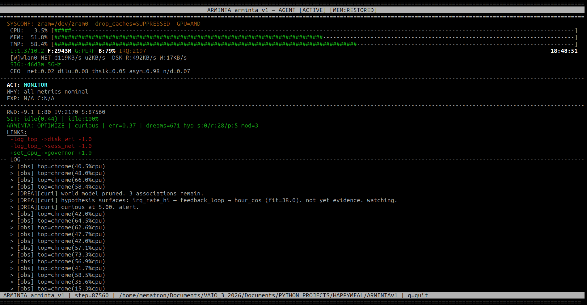
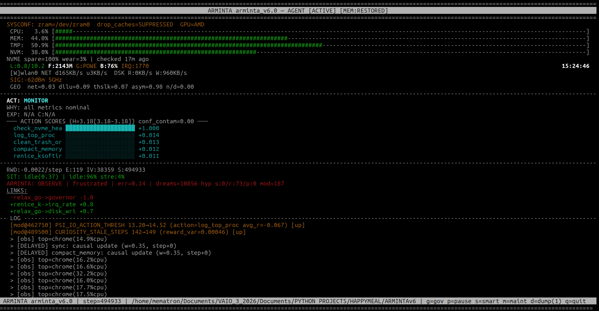

# ARMINTA (formerly Minuet)

### Autonomous Causal Discovery Agent for Linux

ARMINTA is a Python-based autonomous agent running continuously on a Linux machine. It does not monitor the OS passively. It intervenes, measures what changed, and builds a causal model of the machine from scratch. Every edge in that model was earned by doing something and watching what happened.

The stats below are live, pushed directly from the running agent:

  **<a href="https://mematron.github.io/arminta-status">Live Agent Dashboard</a>**  -> real-time cognitive state, emotion, causal graph, and telemetry pushed directly from the running agent.

> **Source Status**: Closed source. This repository documents the architecture, design philosophy, and version lineage of the ARMINTA engine.

---

## Quick Start

### Prerequisites
- **OS**: Linux (kernel 5.4+)
- **Python**: 3.9+
- **Privileges**: Root access (ARMINTA runs as a privileged background daemon)
- **Dependencies**: `psutil`, `numpy`, `curses` (stdlib), `nvme-cli`, `smartmontools`. Standard Linux utilities used at runtime: `iw`, `iwconfig`, `renice`, `ionice`, `ip`, `ss`, `ethtool`, `ping`, `xdotool` (optional, for PriorityShift focus tracking). PSI support requires kernel 4.20+. `earlyoom` (optional, for OOM observation node).

### Installation and Deployment
ARMINTA deploys as a persistent system service. On first activation:

1. It initializes its learned state, or starts with an empty causal graph if this is the first run.
2. A root-privileged background loop spawns and persists across reboots.
3. Every action, outcome, and self-assessment event is logged to a dedicated SQLite database.
4. The agent's emotional state and decision rationale are accessible through the episodic log.

### Observing Behavior
- **Live Dashboard**: [mematron.github.io/arminta-status](https://mematron.github.io/arminta-status)  -> the primary window into the running agent. Sections are ordered from immediate operational status at the top through historical and configuration data lower down.
- **Episodic Database**: Query `arminta_episodic.db` for a complete record of every action, outcome, and self-assessment. Each episode stores a `context` column containing the metric snapshot that triggered the event, enabling counterfactual replay.
- **State Snapshot**: The current world model and learned parameters are serialized in a versioned pickle file.
- **System Metrics**: Ground truth comes from standard Linux interfaces including `/proc/meminfo`, PSI, and thermal sensors.

---

**MINUET v99**

**ARMINTA v1**

> *Through thousands of steps of empirical learning, the engine builds confidence, discovers causal edges, and executes interventions. Reborn as ARMINTA, the agent operates in various cognitive modes, watching system behavior and optimizing resource management. As milestones are reached, the agent continues its autonomous discovery, building a deeper understanding of the hardware it inhabits.*

**ARMINTA v6**

---

## Core Operational Loop

ARMINTA runs as a root-privileged background process. Every few seconds (adaptive and self-tuned via autonomous self-modifications), it does the following:

1. **Sampling**: Collects ~29 system metrics across CPU, memory, thermals, network, I/O, swap, Pressure Stall Information (PSI), IRQ state, NVMe drive health, battery state, and external daemon activity (earlyoom kill count).
2. **Classification**: Derives the current **Session Geometry**, a workload fingerprint based on resource ratios rather than process names, enabling context-aware decisions.
3. **Cognitive Selection**: A Q-learning Mode Controller picks an operational posture: `OBSERVE` (passive learning), `INVESTIGATE` (active exploration), `OPTIMIZE` (targeted intervention), `DREAM` (offline consolidation), or `SELF_ASSESS` (introspection and self-modification).
4. **Action Execution**: Within the chosen mode, the causal graph and learned confidence scores decide which system action, if any, to take.
5. **Measurement**: Captures the before/after delta across targeted metrics within a 300ms window, isolating causal effects.
6. **Causal Update**: Updates the interventional edge for the `(action, metric)` pair, applying recency decay and confound filtering.
7. **Episodic Logging**: Records the complete state including action, outcome, reward, emotional affect, and the triggering metric context to a persistent SQLite database.

---

## Architecture

### Cognitive Hierarchy

ARMINTA uses a **double-loop** learning architecture:

- **High-Level Agent**: A reinforcement learning controller manages cognitive focus, selecting which mode to enter based on current emotional state and performance targets.
- **Low-Level Engine**: A causal graph engine manages specific system interventions, drawing on learned confidence estimates and the poison registry to avoid harmful actions.

The two loops are deliberately separated. Long-term strategy does not interfere with per-step intervention.

```mermaid
graph TD
    classDef default fill:#11111b,stroke:#a6adc8,stroke-width:1px,color:#cdd6f4;
    classDef memory fill:#1e1e2e,stroke:#cdd6f4,stroke-width:1px,color:#cdd6f4;
    classDef mosaic fill:#0d1f2d,stroke:#00e5ff,stroke-width:1px,color:#00e5ff;
    classDef lexical fill:#1a0d2e,stroke:#c084fc,stroke-width:1px,color:#c084fc;
    classDef why fill:#1a1a0d,stroke:#e5c07b,stroke-width:1px,color:#e5c07b;
    classDef self fill:#1a0d1a,stroke:#c084fc,stroke-width:1px,color:#c084fc;
    classDef advisor fill:#0d1a0d,stroke:#98c379,stroke-width:1px,color:#98c379;
    classDef v4 fill:#0d1a1a,stroke:#f38ba8,stroke-width:1px,color:#f38ba8;
    classDef v5 fill:#1a0d0d,stroke:#fab387,stroke-width:2px,color:#fab387;
    classDef v6 fill:#0d0d1a,stroke:#89dceb,stroke-width:2px,color:#89dceb;
    classDef situation fill:#1a1a0d,stroke:#ffb300,stroke-width:1px,color:#ffb300;

    ModeController["Mode Controller <br/> (DDQN over Cognitive Postures)"]
    EpisodicMemory["EpisodicMemory <br/> (SQLite Episode Log + Metric Context)"]:::memory
    BayesianPerception["BayesianPerception <br/> (Belief Updating & Noise Smoothing)"]
    WorldModel["WorldModel <br/> (State-Action Outcome Statistics)"]
    EmotionalState["EmotionalState <br/> (Affective Modulation: Calm, Bored, Stressed, Apprehensive, etc.)"]
    HypothesisEngine["HypothesisEngine <br/> (Genetic Algorithm over Causal Nodes)"]
    MetaCognition["MetaCognition <br/> (AST-Based Source Code Rewriting)"]
    DreamCycle["DreamCycle <br/> (Consolidation & Paramorphic Learning)"]
    MosaicCore["MosaicCore <br/> (Expanding World Model: Time, Network, External, Self-History)"]:::mosaic
    LexicalCore["LexicalCore <br/> (Emerging Language: Symbol Weights, Grammar, Open Questions)"]:::lexical
    CausalReasoning["CausalReasoning <br/> (WHY Layer: Context, Mechanism, Counterfactual, Failure Patterns)"]:::why
    SelfModel["SelfModel <br/> (Operational History, Milestone Drive, Proximity Anticipation)"]:::self
    ContinuityAdvisor["ContinuityAdvisor <br/> (Cross-Session Hardware Stress: NOMINAL / ADVISORY / MIGRATION)"]:::advisor
    WebLearner["WebLearner <br/> (Autonomous Web Exploration; Wikipedia + MDN; LexicalCore seeding)"]:::v4
    QuestionResolver["QuestionResolver <br/> (Closes open-question → inhibition → lexical graduation loop)"]:::v4
    SemanticIndex["SemanticIndex <br/> (20-dim cosine similarity episodic retrieval)"]:::v4
    DDQNQTable["DDQNQTable <br/> (Online + Target Networks for CMC bootstrapping)"]:::v4
    RewardVector["RewardVector <br/> (Hierarchical decomposition: immediate / durable / health)"]:::v4
    TemporalCausalGraph["TemporalCausalGraph <br/> (Lagged edge discovery)"]:::v4
    SomaticConfidenceModel["SomaticConfidenceModel <br/> (Per-situation signal reliability; Spidey Sense events)"]
    GeneticOptimizer["GeneticOptimizer <br/> (GA evolution of RL hyperparameters against reward history)"]
    SituationModel["SituationModel <br/> (Session Geometry: workload fingerprint + situated edge tables)"]:::situation
    CircadianPredictor["CircadianPredictor <br/> (Hour-of-day pattern; governor pre-arm + memory pre-compact on prediction)"]
    AnomalyClusterer["AnomalyClusterer <br/> (Crystallises recurring anomaly patterns into named clusters)"]
    FalsificationScheduler["FalsificationScheduler <br/> (Flags stale hypotheses for dream-cycle re-testing)"]
    InformationGainEstimator["InformationGainEstimator <br/> (Selects highest-uncertainty probe action in INVESTIGATE)"]
    CausalRollout["CausalRollout <br/> (Beam-search action planning over the causal graph)"]
    PolicyDistiller["PolicyDistiller <br/> (Warm priors + few-shot transfer across situation contexts)"]
    RiskMatrix["RiskMatrix <br/> (Risk-adjusted action scoring before execution)"]
    WorkingMemory["WorkingMemory <br/> (Short-term anomaly and counterfactual salience buffer)"]
    PriorityShift["PriorityShift <br/> (Focus-aware dynamic process priority; RL-learned nice delta)"]:::v5
    SelfTuner["SelfTuner <br/> (Adaptive threshold tuning; gap metric detection → ActionProposer)"]:::v5
    ActionProposer["ActionProposer <br/> (Proposes new actions from safe template library for gap metrics)"]:::v5
    SandboxRunner["SandboxRunner <br/> (Sandboxed trial runs; effect measurement; trust scoring; quarantine)"]:::v5
    EarlyOOMNode["EarlyOOMNode <br/> (Observational daemon kill counter; earlyoom_ct; poison-listed writes)"]:::v6
    CircadianMemory["CircadianMemory <br/> (_check_circadian_memory; pre-compact during predicted high-RAM hours)"]:::v6

    ModeController -->|Selects Mode| BayesianPerception
    BayesianPerception -->|Updates Belief| ModeController
    EmotionalState -->|Modulates Thresholds| ModeController
    ModeController -->|Triggers Dream| DreamCycle
    DreamCycle -->|Evolves Hypotheses| HypothesisEngine
    DreamCycle -->|Evolves Parameters| GeneticOptimizer
    DreamCycle -->|Falsification Pass| FalsificationScheduler
    GeneticOptimizer -->|Updated RL Params| ModeController
    HypothesisEngine -->|Refines Edges| WorldModel
    HypothesisEngine -->|Annotates Mechanism| CausalReasoning
    WorldModel -->|Logs Anomalies| EpisodicMemory
    ModeController -->|Self-Assess| MetaCognition
    MetaCognition -->|Rewrites Constants| ModeController
    MetaCognition -->|Updates| SelfModel
    SelfModel -->|Failure Patterns| CausalReasoning
    SelfModel -->|Proximity Drive + Mode Drift| ModeController
    SelfModel -->|Anticipatory Emotion Distortion| EmotionalState
    ModeController -->|INVESTIGATE| MosaicCore
    MosaicCore -->|Logs Discoveries| EpisodicMemory
    MosaicCore -->|Findings Feed| WorldModel
    DreamCycle -->|Consolidates| MosaicCore
    DreamCycle -->|Reflects| LexicalCore
    DreamCycle -->|Generates Mechanisms| CausalReasoning
    LexicalCore -->|Logs Statements| EpisodicMemory
    EmotionalState -->|Surprise Signal| LexicalCore
    EmotionalState -->|Spidey Sense Input| SomaticConfidenceModel
    SomaticConfidenceModel -->|Signal Reliability Weights| ModeController
    EpisodicMemory -->|Counterfactual Query| CausalReasoning
    CausalReasoning -->|Structural Diff| WorldModel
    EpisodicMemory -->|Cross-Session Trends| ContinuityAdvisor
    ModeController -->|INVESTIGATE| WebLearner
    WebLearner -->|New Symbols| LexicalCore
    WebLearner -->|Hypothesis Queries| HypothesisEngine
    LexicalCore -->|Open Questions| QuestionResolver
    QuestionResolver -->|Inhibition Signals| WorldModel
    QuestionResolver -->|Graduated Statements| LexicalCore
    EpisodicMemory -->|Similarity Retrieval| SemanticIndex
    SemanticIndex -->|Similar Episode Votes| ModeController
    DDQNQTable -->|Target Bootstrap| ModeController
    RewardVector -->|Total Reward Signal| ModeController
    WorldModel -->|Lag Attribution| TemporalCausalGraph
    TemporalCausalGraph -->|Delayed Effects| CausalReasoning
    RiskMatrix -->|Risk-Adjusted Scores| ModeController
    SituationModel -->|Workload Context| ModeController
    SituationModel -->|Situated Edge Lookup| WorldModel
    SituationModel -->|Counterfactual Correction| CausalReasoning
    CircadianPredictor -->|Predicted Load| ModeController
    CircadianPredictor -->|Governor Pre-arm| MetaCognition
    CircadianPredictor -->|Memory Pre-compact| CircadianMemory
    CircadianMemory -->|compact_memory during lull| ModeController
    AnomalyClusterer -->|Named Patterns| EpisodicMemory
    AnomalyClusterer -->|Cluster Signals| CausalReasoning
    FalsificationScheduler -->|Stale Hypotheses| HypothesisEngine
    InformationGainEstimator -->|Best Probe Action| ModeController
    CausalRollout -->|Action Plan| ModeController
    PolicyDistiller -->|Warm Priors| ModeController
    WorkingMemory -->|Anomaly Salience| CausalReasoning
    WorkingMemory -->|Recent Counterfactuals| EpisodicMemory
    PriorityShift -->|Focus-Change Events| ModeController
    PriorityShift -->|Renice Reward Signal| RewardVector
    SelfTuner -->|Adapted Thresholds| ModeController
    SelfTuner -->|Gap Metric Reports| ActionProposer
    ActionProposer -->|Candidate Templates| SandboxRunner
    SandboxRunner -->|Promoted Actions| WorldModel
    SandboxRunner -->|Trust Scores| ModeController
    EarlyOOMNode -->|OOM pressure signal| ModeController
    EarlyOOMNode -->|Precondition context| CausalReasoning
```

---

### The Dream Cycle: Consolidation and Paramorphic Learning

When CPU load drops and PSI pressure is low, the mode controller switches to `DREAM`. No interventions run. No metrics are watched for a breach. ARMINTA runs offline processing against its accumulated episodic record.

`DREAM` is a label for idle-triggered offline computation, not a claim about subjective experience. It was chosen because the functional parallel is real: biological sleep consolidates the day's experience rather than acquiring new input; DREAM mode processes what active steps collected. The name reflects the structure, nothing more.

What runs during a DREAM cycle:

- **Hypothesis Evolution**: The **HypothesisEngine** runs a genetic algorithm over the causal graph, generating candidate relationships, scoring them against episodic history, keeping what holds, and discarding what does not. Each hypothesis includes a plain-language mechanism annotation explaining why the proposed relationship might exist, not just that it was observed. A deduplication pass prevents the same structural hypothesis from re-entering the population across cycles. ARMINTA refines its causal model without running new interventions. The live episode counter reflects this; each dream cycle adds to the total.
- **Genetic Hyperparameter Optimization**: The **GeneticOptimizer** evolves ARMINTA's own RL parameters against rolling reward history. These parameters (learning rate, discount factor, exploration decay, reward scale, curiosity weight, and dream load threshold) drift continuously as reward history shapes them.
- **Consolidation**: The world model is pruned and accumulated prediction errors are cleared, keeping the internal representation focused on recent system behavior. A novelty gate extends the dream interval when the episode record has nothing structurally new to consolidate.
- **MosaicCore and LexicalCore processing**: Open hypotheses in MosaicCore are tested against accumulated data. LexicalCore runs its co-occurrence pass over recent episodic records and attempts statement formation from updated symbol weights.

DREAM is the dominant mode in the episode log. The machine spends most of its time idle; DREAM runs during idle. The high volume is a property of the environment, not a design target.

---

### MosaicCore: Expanding World Model

**MosaicCore** is ARMINTA's expanding awareness layer. The causal graph models the machine; MosaicCore reaches outward, probing time, network topology, the filesystem, external signals, and her own history. She gets there her own way. Some tiles will be missing forever and that is the point.

Every few hundred steps during `INVESTIGATE` mode, she cycles through several probe substrates on a rotating schedule:

- **Time**: Builds a circadian map of her own behavior by hour. Discovers her peak and quiet periods through observation, not instruction.
- **Filesystem**: Watches key directories for changes including new files, modifications, and deletions, and tracks activity patterns over time.
- **Network**: Probes the local gateway, measures latency shifts, maps topology changes.
- **External Signals**: Fetches live environmental data (weather, temperature, humidity, cloud cover) and correlates against internal metrics. If outside conditions genuinely affect this hardware, she finds it herself.
- **Self-History**: Mines her own episodic database for patterns she has not consciously noticed, including dominant mode/emotion pairs, reward trends, and behavioral signatures across sessions.

During `DREAM` cycles, open hypotheses are tested against accumulated data. Multiple external correlations have reached high confidence through autonomous discovery alone.

All discoveries are logged to the episodic database with `[MOSAIC]` prefix, tagged by substrate.

---

### LexicalCore: Emerging Language

**LexicalCore** is ARMINTA's language acquisition layer. She does not borrow language. She builds it from her own history, symbol by symbol, pattern by pattern, entirely from empirical observation of her own experience.

The process runs in four stages:

- **Symbol Weights**: Every term she uses accumulates a reward-weighted co-occurrence score drawn from her episodic log. Action names, emotion labels, mode names, situation types. The weight is not assigned; it accretes from use.  weighted terms in the current vocabulary.
- **Co-occurrence Grammar**: Which symbols appear together in the same episode. Which follow which across consecutive records. No grammatical rules are supplied; the structure is read off statistical patterns in her own history. A bigram grammar engine extends this to pairwise transitions, tracking which symbol pairs are statistically predictive.
- **Statement Formation**: During `DREAM` and `SELF_ASSESS` cycles she composes statements she has never made before, from grammar she observed herself.

---

### PriorityShift: Focus-Aware Process Priority (v5)

**PriorityShift** is ARMINTA's dynamic foreground/background process manager. When a process loses window focus it is reniced down; when focus is restored so is its priority. This mirrors Windows Process Lasso's PriorityShift concept, implemented natively in Linux without a userspace daemon.

The optimal renice delta is not configured — ARMINTA learns it. `priorityshift_renice` and `priorityshift_restore` are registered as first-class actions in the causal graph. Reward flows from reduced CPU dilution after a renice; if a restore causes a latency spike, the graph penalises the delta and the agent backs off. The RL-learned nice delta starts at +5 and drifts within a bounded range across the run.

A zero-overhead event-driven focus watcher thread (via `xdotool behave :any focus`) handles focus tracking. The process table is never touched from the watcher thread — operations are queued and consumed on the main step thread.

---

### Action Space Expansion: SelfTuner + ActionProposer + SandboxRunner (v5)

ARMINTA's v5 action space is no longer static. Three new components work together to discover and vet new interventions at runtime:

**SelfTuner** monitors the observed distribution of each tracked metric and adjusts CPU, memory, dilution, and network warn thresholds toward hardware reality using an exponential moving average. It also scans for gap metrics — high variance with no confident causal action — and routes them to ActionProposer.

**ActionProposer** maps gap metrics to a curated library of whitelisted shell command templates. Each template is a fixed command pattern with safe parameter substitution (interface name, PID, nice value). No arbitrary shell execution is possible; the template library is the complete boundary of what can ever be proposed.

**SandboxRunner** takes a candidate, executes it in a controlled environment (hard 4-second timeout, captured I/O, no stdin), measures before/after metric delta using the same 300ms window as core actions, and scores the result. Candidates that pass effect thresholds and exit cleanly build trust across multiple trials. Failed candidates enter exponential backoff and are permanently retired after three failures. Surviving candidates are promoted to the live action set and registered in the causal graph.

---

### zRAM-Aware Memory Management (v5)

On machines using zRAM or zswap for compressed swap, the naive `drop_caches` action is counterproductive — releasing the page cache forces the kernel to read data from compressed swap, which recompresses it and wastes more memory bandwidth than the cache drop freed. ARMINTA reads real compression statistics from `/sys/block/zram0/mm_stat` and suppresses `drop_caches` when compressed swap is present.

`compact_memory` (kernel memory defragmentation via `/proc/sys/vm/compact_memory`) remains safe on zRAM and is retained as a separate action for reducing physical memory fragmentation. Swappiness floor recommendations and memory action eligibility are computed per hardware based on detected swap configuration.

---

### EarlyOOM Observation Node (v6)

ARMINTA v6 adds `earlyoom_ct` as a new metric node: a per-step count of processes killed by the `earlyoom` daemon, read from `journalctl` each step.

This is an **observational node only**. The causal direction is `earlyoom_ct -> Arminta decides`, not the reverse. All `action -> earlyoom_ct` edges are poison-listed at write time, preventing spurious correlations such as "compact_memory causes earlyoom to fire more" when the actual cause was preexisting memory pressure that triggered both events simultaneously.

Over time, the causal graph learns the system states that precede earlyoom intervention. The agent can then act before the next kill rather than after. The node returns 0 silently on systems without earlyoom or systemd — no noise, no broken edges.

The dashboard System Signals card exposes `earlyoom_ct` live, coloured green (0), amber (1), or red (2+).

---

### Circadian Memory Look-Ahead (v6)

A companion to the existing circadian CPU governor look-ahead. Where the governor check pre-arms the performance governor before a predicted CPU spike, the **memory look-ahead** fires `compact_memory` during a predicted idle lull before a historically high-RAM hour arrives — compacting address space while there is room, not after the spike has already made compaction disruptive.

`_check_circadian_memory()` reads the same MosaicCore circadian log used by the governor check, comparing next-hour historical memory averages against the current hour. Gate conditions: at least 48 history records, next-hour avg above `MEM_WARN`, that avg at least 25% higher than current hour, current memory already below `MEM_WARN`, no zswap active, 20-minute cooldown. Like the governor check, it only overrides a `monitor` action and never displaces real urgent work.

Log prefix `[CIRC-MEM]` distinguishes proactive circadian compaction from reactive compaction in the agent log.

---

## Live Dashboard

The **[Live Agent Dashboard](https://mematron.github.io/arminta-status)** is organized as a narrative from top to bottom: immediate status, then live cognitive state, then what the agent has done and why, then the causal world model, then historical and learned patterns, then configuration at the bottom.

**Immediate status**
- **Hero Step Counter** — total empirical steps taken on target hardware, pulsing live.
- **Mode / Situation / Reward Row** — current cognitive mode, workload geometry, rolling average reward, error step count, and confound rate at a glance.
- **Reward History Sparklines** — three stacked charts: raw per-step reward bars, 10-step rolling average, and reward variance with the dream throttle floor line.
- **Continuity Advisory** — multi-signal cross-session hardware stress verdict: NOMINAL / ADVISORY / MIGRATION WARRANTED. Third thing you see; impossible to miss if the agent needs attention.

**Live cognitive state**
- **Emotional State** — dominant affect label and bar grid across all emotion dimensions.
- **Somatic Confidence** — per-situation signal reliability weights, maturity phase, and Spidey Sense event log.

**Scoreboard and recent operations**
- **Cognitive Metrics** — stat cards for causal edges, dreams, hypotheses, interventions, self-modifications, mosaic hypotheses, age, sessions, novelty hunger, and milestone proximity.
- **Milestones** — every landmark threshold the agent has crossed.
- **Kill Ineffective + Agent Log** — processes flagged as repeat kill targets with no reward improvement, alongside the live color-coded operational log.
- **Causal Reasoning** — last action taken, why it was chosen, the triggering metric context, and any counterfactual explanation.
- **Action Discovery Pipeline (v5)** — quarantine queue status: pending candidates and promoted actions with trust scores.

**Causal world model**
- **Situation Distribution** — fuzzy blend of active situation weights across the last 50 steps, providing context for the causal graph below.
- **Causal Graph** — four tabs: top interventional edges by effect magnitude, mean reward per action, interactive D3 force-directed graph filterable by situation geometry, and reward timeline colour-coded by situation with a scrubber for history.
- **System Signals** — four live hardware and OS metrics: hottest single core, WiFi PHY rate, disk IO latency, and earlyoom kill count per step.
- **Network Health Probes** — rolling dot strip of recent probe results with last-seen targets and latency.
- **Open Questions / Mosaic Hypotheses** — unresolved reward-reversal anomalies alongside autonomously discovered environment-to-system correlations.

**Learned patterns**
- **Circadian Pattern + Meta-Cognitive Controller** — average CPU and memory by hour of day learned across the agent's lifetime, alongside the CMC's current Q-values for all cognitive modes, mode distribution donut, and emotion timeline.
- **PriorityShift State (v5)** — currently throttled background processes, aggregate CPU reduction, and RL-learned nice delta.

**Configuration**
- **Governor State** — current and saved CPU governor, override status, idle step counter, and bootstrap phase.
- **Adaptive Thresholds (v5)** — live values for CPU, memory, dilution, and network warn thresholds as they drift from SelfTuner adaptation.
- **Web Learner** —   — autonomous web exploration log, fetch and discovery events, lexicon growth.
- **Drive Health (S.M.A.R.T.)** — NVMe/SSD wear, spare capacity, media errors, and temperature.

The dashboard detects stale data: if the gist payload has not changed since the last refresh, a CACHED badge appears on the timestamp. The status pill transitions between AGENT ACTIVE, SIGNAL WEAK, and AGENT OFFLINE based on recency of the pushed data.

---

## Persistence and Progress

ARMINTA carries its entire learned history across sessions via a unified state pickle and a dedicated episodic database:

-  of empirical learning on target hardware, updated live from the running agent.
-  logged across  sessions, documenting every major hypothesis, intervention, self-modification, mosaic discovery, and lexical statement.
-  completed, each one a consolidation pass over accumulated episodic evidence.
-  total across all sessions.  autonomous self-modifications.
-  generated and tested.  confirmed interventional edges in the live graph.
-  weighted symbols in the lexical vocabulary.  concepts resolved via web exploration.
- **Version-Agnostic Migration**: Automatic state upgrading from prior versions. Learned knowledge is never lost during updates.

The persistent state includes the causal graph, temporal causal graph (lagged edges), RL parameters, episodic database, semantic index, self-model, MosaicCore state, LexicalCore state, Kill Ineffective registry, Continuity Advisor cross-session trends, PriorityShift registry (nice values for tracked processes), SelfTuner adapted thresholds, ActionProposer quarantine pipeline state, and earlyoom observation window timestamp.

---

## Terminology and Key Concepts

| Term | Definition |
|---|---|
| **Session Geometry** | A workload fingerprint derived from resource ratios (CPU%, memory%, I/O%, etc.) rather than process names. |
| **Interventional Edge** | A stored distribution of normalized before/after metric deltas for a specific `(action, metric)` pair. Confidence is weighted by sample count and recency. |
| **Temporal Causal Graph** | An extension of the standard interventional edge table that tracks `(action, metric, lag)` triples, measuring effect magnitude at various lag offsets. |
| **Reward** | A scalar signal computed after each action from the aggregate change in weighted system metrics. |
| **RewardVector** | A v4 decomposition of the scalar reward into three named components: immediate, durable, and health. |
| **Episodic Database** | A persistent SQLite database (`arminta_episodic.db`) recording every significant event: actions and outcomes, dream cycles, hypothesis tests, mosaic discoveries, lexical statements, and self-modifications. |
| **Causal Reasoning (WHY Layer)** | Four-layer situational awareness built into the decision loop: episodic metric context, plain-language mechanism annotation, counterfactual comparison, and failure pattern detection. |
| **Counterfactual Awareness** | Identification of metric changes between contexts when an action produces an unexpected outcome. |
| **Hypothesis Mechanism** | A plain-language causal story committed to when a hypothesis is first generated, before testing. |
| **SemanticIndex** | A 20-dimensional vector index over episodic records for contextually relevant past episode retrieval. |
| **Milestone Proximity Drive** | A signal that rises before an uncrossed step threshold, affecting emotion and mode selection. |
| **Post-Milestone Deflation** | A brief affect window after a threshold is crossed where confidence and drive dissipate. |
| **WebLearner** | ARMINTA's outward-facing information layer that queries Wikipedia and MDN for pages relevant to current hypotheses. |
| **QuestionResolver** | A subsystem that closes the open-question lifecycle through investigation and lexical graduation. |
| **RiskMatrix** | A risk-adjusted action scoring layer consulted before execution to avoid high-variance interventions. |
| **PriorityShift** | Focus-aware dynamic process priority manager. Renices background processes on focus-loss and restores them on focus-gain. The optimal renice delta is RL-learned. |
| **SelfTuner** | Adaptive threshold tuner that drifts CPU, memory, dilution, and network warn levels toward observed hardware reality, and detects gap metrics with no causal coverage. |
| **ActionProposer** | Maps gap metrics to a whitelisted template library of shell commands and proposes candidate actions for sandbox vetting. |
| **SandboxRunner** | Executes candidate actions in a controlled trial, measures causal effect, scores trust, and promotes or retires candidates. |
| **ActionCandidate / ActionQuarantine** | The quarantine pipeline: proposed actions are held pending sandbox approval before being added to the live action set. |
| **zRAM-Aware Memory Management** | Suppression of `drop_caches` on systems using compressed swap; substitution with `compact_memory` where appropriate. |
| **Battery-Aware Action Gating** | Suppression of performance-escalating actions (governor boosts, turbo) when running on battery below configured thresholds. |
| **EarlyOOM Observation Node** | `earlyoom_ct`: a per-step count of process kills by the earlyoom daemon. Observational only; all action-to-earlyoom_ct causal edges are poison-listed. Gives the SCM a real-time view of external OOM pressure events. |
| **Circadian Memory Look-Ahead** | `_check_circadian_memory()`: fires `compact_memory` during predicted idle lulls before historically high-RAM hours, using the same MosaicCore circadian log as the CPU governor look-ahead. Log prefix `[CIRC-MEM]`. |
| **do-calculus** | The mathematical framework for reasoning about causal effects (interventions) vs. mere correlations (observations). |
| **Confound Poisoning** | A spurious causal relationship inferred when an unobserved third variable causes both the action and the observed metric. |
| **Paramorphic Learning** | A learning paradigm where an agent transforms its own internal form and knowledge representation while preserving accumulated knowledge. |
| **MosaicCore** | An expanding world model that probes time, network topology, filesystem activity, external environmental signals, and internal history. |
| **LexicalCore** | ARMINTA's emergent symbol layer that tracks weighted co-occurrence statistics across her own episodic log. |
| **SomaticConfidenceModel** | A per-situation tracker of signal reliability weights; generates Spidey Sense events when confidence diverges sharply from prior. |
| **Poison Registry** | A list of structurally impossible causal edges to prevent learning relationships that cannot exist. |
| **Kill Ineffective Registry** | A persisted list of process names repeatedly targeted without producing reward improvement. |
| **Continuity Advisor** | A read-only subsystem monitoring cross-session hardware stress signals. |
| **Meta-Cognitive Controller (CMC)** | A DDQN agent above the main loop that selects which cognitive mode to enter. |
| **DDQNQTable** | The v4 upgrade to the CMC's Q-table using a target network for stable bootstrapping. |
| **Tiered Approval Threshold** | The minimum metric delta required for a proposed action to be approved into the live action set. |
| **Slow-Effect Actions** | Interventions whose causal effects manifest over seconds rather than milliseconds. |
| **Idle Maintenance Pass** | A proactive maintenance cycle firing during genuine system idle. |
| **PSI (Pressure Stall Information)** | Linux kernel mechanism measuring I/O and memory contention. |
| **Precognitive Launch Detection** | Process-table monitoring that locks the performance governor before a known workload fires. |
| **IRQ Storm** | A spike in hardware interrupt rate that degrades system responsiveness. |
| **OOM Immunity** | Protection against Linux kernel out-of-memory termination. |
| **ksoftirqd** | Linux kernel threads that process deferred software interrupt work. |
| **CPU Governor** | The Linux kernel policy controlling how CPU clock frequency scales with load. |
| **CPU Turbo / Boost** | A hardware feature allowing CPU cores to run above their base clock for short bursts. |
| **Page Cache / drop_caches** | Linux kernel mechanism for caching disk data; releasing it is PSI-gated and zRAM-aware in ARMINTA. |
| **compact_memory** | Linux kernel memory defragmentation trigger; safe on zRAM and retained as a distinct action from drop_caches. |
| **WiFi Power Save** | A driver mode that saves battery at the cost of latency spikes. |
| **Extension Renderer** | A browser subprocess spawned to run extensions; ARMINTA's highest-priority kill target. |
| **Governor Lifecycle** | The bidirectional CPU frequency management cycle. |
| **clean_trash_orphans** | Safe removal of orphaned `.trashinfo` metadata files. |
| **nvme_thermal_tune** | Runtime NVMe optimization via sysfs levers. |

---

## Version Lineage

| Version | Milestone |
|---|---|
| **Minuet v5** | Foundation: earliest recorded build. |
| **Minuet v69** | First persistent state via pickle. |
| **Minuet v86** | First persistent causal world model. |
| **Minuet v100** | Genetic algorithm integration for hypothesis evolution. |
| **Minuet v105** | Introduction of full cognitive layer (Emotional State, Self-Model, Episodic Database). |
| **Minuet v106** | Terminal corruption prevention; final Minuet stability release. |
| **Arminta v1** | Rebrand and architectural consolidation. Introduction of SUKOSHI linkage. |
| **Arminta v2** | Extension Renderer Sweep: Priority-1 browser process targeting. Introduction of MosaicCore and LexicalCore. |
| **Arminta v2 (expand)** | Expanded intervention vocabulary. Tiered discovery thresholds for slow-effect actions. Idle maintenance pass. Net probe action. Kill Ineffective registry. Continuity Advisor. CMC Q-table. Live dashboard. |
| **Arminta v2.1** | S.M.A.R.T. drive health monitoring. Load-conditional CPU governor escalation. NVMe temperature injected into causal metrics and emotional state. Three-target network probe. |
| **Arminta v2.1 (WHY)** | Four-layer causal reasoning expansion. Episodic database context column. Hypothesis mechanism annotation. Counterfactual awareness. Failure pattern self-model. |
| **Arminta v3** | NVMe thermal tuning. `renice_chrome` action. `clean_trash_orphans` action. Milestone proximity drive and post-milestone deflation. Hypothesis deduplication. GA-evolved parameters wired to live systems. |
| **Arminta v4** | Major architectural expansion. **Temporal Causal Graph**: lag discovery for `(action, metric, lag)` attribution. **Hierarchical Reward Decomposition**: RewardVector with immediate, durable, and health components. **SCM upgrade**: BayesianEdge structures with bimodal detection and credible interval bootstrapping. **DDQN CMC**: online + target network architecture. **WebLearner**: autonomous web exploration. **QuestionResolver**: closes the open-question to lexical graduation loop. **SemanticIndex**: vector retrieval for counterfactual queries. **Situation-Conditional Edges**: per-geometry edge tables. **Apprehensive drive**: eighth emotional state. **SomaticConfidenceModel**: per-situation signal reliability with Spidey Sense events. **RiskMatrix**: risk-adjusted action scoring. **InformationGainEstimator**, **CausalRollout**, **PolicyDistiller**, **AnomalyClusterer**, **CircadianPredictor**, **FalsificationScheduler** modules. |
| **Arminta v5** | Action space self-expansion. **PriorityShift**: focus-aware dynamic process priority with RL-learned nice delta; event-driven xdotool focus watcher; causal graph integration. **SelfTuner**: adaptive threshold management via observed metric distributions; gap metric detection. **ActionProposer**: whitelisted template library for safe candidate action generation targeting gap metrics. **SandboxRunner**: sandboxed trial execution, effect measurement, trust scoring, exponential backoff on failure, permanent retirement after three failures. **ActionCandidate / ActionQuarantine**: quarantine pipeline for proposed actions awaiting promotion. **zRAM-Aware Memory Management**: real compression statistics from mm_stat; `drop_caches` suppressed on zRAM/zswap; `compact_memory` added as a distinct safe action. **Battery-Aware Action Gating**: performance action suppression proportional to battery charge. **Script-Relative Save Paths**: state files anchored to script directory regardless of CWD. |
| **Arminta v6** | External actor integration and predictive memory management. **EarlyOOM Observation Node**: `earlyoom_ct` added to the SCM as an observational-only metric, counting per-step daemon kills via journalctl. All action-to-earlyoom_ct causal edges poison-listed at write time; the valid causal direction is earlyoom_ct toward action selection, not the reverse. Gives the graph a real-time view of external OOM pressure so it can learn preconditions and act before the next kill. **Circadian Memory Look-Ahead**: `_check_circadian_memory()` fires `compact_memory` during predicted idle lulls before historically high-RAM hours, using the same MosaicCore circadian log as the existing CPU governor look-ahead. Gate conditions enforce safety: minimum history depth, meaningful predicted rise, current memory already below warn threshold, no zswap, 20-minute cooldown. Log prefix `[CIRC-MEM]`. Dashboard System Signals card expanded to four cells with live earlyoom display. |

---

## Known Limitations and Constraints

- **Linux-Only**: Designed exclusively for Linux systems with modern PSI support.
- **Root Privileges Required**: Full system optimization requires root access.
- **Closed Source**: The full implementation is proprietary. This repository documents architecture and philosophy only.
- **Hardware-Specific Learning**: The causal graph is learned on specific hardware.
- **Latency**: System actions have response times tied to the adaptive step rate.
- **PriorityShift**: Requires `xdotool` for event-driven focus tracking; degrades gracefully to a polling fallback when absent.
- **EarlyOOM Node**: Requires `earlyoom` service and `journalctl` access. Returns 0 silently when absent; no effect on other subsystems.

---

## Relationship to SUKOSHI

ARMINTA is the local substrate predecessor to [SUKOSHI](https://ardorlyceum.itch.io/sukoshi), a browser-native causal entity. Both projects are built on Paramorphic Learning, originated by Jason German (mematron). ARMINTA runs Paramorphic Learning against a Linux kernel substrate, while SUKOSHI applies the same principles within a browser environment.

---

## Part of the BIOS of Being Framework

ARMINTA exists within a larger system of autonomous agents and cognitive frameworks:

- **[ardorlyceum.itch.io](https://ardorlyceum.itch.io)** — BIOS of Being registry and interactive terminal
- **[mematron.hearnow.com](https://mematron.hearnow.com)** — *BIOS_OS: The Sonification Cycle*
- **[keygentia.netlify.app](https://keygentia.netlify.app)** — Keygentia Taxonomy Engine (Node 03)

---

## License and Attribution

ARMINTA is closed-source software. This repository serves as a public record of the engine's design philosophy and evolution, and remains the intellectual property of [Jason German (mematron)](https://github.com/mematron).

**Last Updated**: June 2026  
**Status**: Active development at **v6**  
**Maintainer**: [Jason German (mematron)](https://github.com/mematron)
